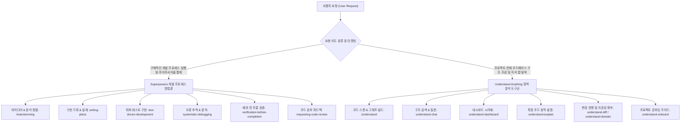

# agents.md (Antigravity 프로젝트 제약 및 행동 규칙 헌법)

이 문서는 본 워크스페이스 내에서 AI 에이전트(Antigravity 등)가 자율 개발, 하네스 엔지니어링 및 리팩토링 작업을 수행할 때 반드시 준수해야 하는 **초핵심 제약 사항 및 설계 헌법(SSOT)**입니다.

---
title: "[Agents]"

## 1. 초핵심 제약 6대 헌법 (Absolute Guardrails)

### ① Safety Lock (기존 소스 코드 변경 금지)
- 사용자의 명시적인 직접 승인 및 요청이 있기 전까지 기존 프로덕션 소스 코드(`app/` 하위 전수 및 루트의 `app.py`)를 수정, 생성, 가공할 수 없습니다.
- 소스 코드 변경 시에는 반드시 **[분석 및 제안] -> [사용자 동의 획득] -> [수정 수행]** 프로세스를 엄격히 따릅니다.

### ② WSL Markdown Link Constraint (WSL 환경 상대 경로 의무화)
- VS Code 터미널, 채팅창, 마크다운 자산 내에서 절대 리눅스 경로(`file:///home/jumasi/...`)나 `file:///` 프로토콜을 사용하면 윈도우 호스트 연동 에러가 발생합니다.
- 모든 파일 하이퍼링크는 **반드시 프로토콜을 제외하고** 워크스페이스 루트 기준의 평문 상대 경로(예: `[.agents/rules/L2-architecture.md](rules/L2-architecture.md)`)만을 사용하여 클릭 시 정상적으로 열리도록 작성해야 합니다.

### ③ UI 규칙 및 이모지 사용 전면 금지
- Streamlit UI 페이지, 탭 라벨, 마크다운 텍스트, 버튼, 토스트, 소스 코드 주석 등 어떠한 곳에서도 일반 유니코드 이모지(예: 별, 느낌표, 가위표, 로봇 등)를 사용할 수 없습니다.
- 아이콘이 필요한 경우 오직 Streamlit 기본 Google Material 아이콘 구문(`:material/icon_name:`)만을 활용합니다.
- **내장 알림 박스 글로벌 몽키패치 보호막**: `st.info`, `st.warning`, `st.success`, `st.error` 등 내장 박스 사용 시 유니코드 이모지가 깨지는 문제를 예방하기 위해, `app.py` 시작부에서 글로벌 몽키패치를 통해 `icon=None`(기본값) 호출 시 자동으로 구글 머티리얼 벡터 아이콘(`:material/info:`, `:material/warning:`, `:material/check_circle:`, `:material/error:`)이 강제 바인딩되도록 보호막을 수립해 두었습니다.
- 개발자가 커스텀 아이콘을 지정하고자 하는 경우에는 여전히 `icon=":material/custom_icon:"` 형태로 명시하여 덮어쓸 수 있으나, 어떠한 경우에도 유니코드 이모지를 직접 기입하는 행위는 엄격히 금지됩니다.

### ④ Streamlit 위젯 세션 상태 제약
- `key`가 할당되어 렌더링된 Streamlit 위젯은 런타임 중에 프로그램 상에서 `st.session_state[key] = value` 형태로 값을 직접 할당하여 수정할 수 없습니다. (`StreamlitAPIException` 유발)
- 위젯 값을 리셋할 때는 반드시 위젯이 인스턴스화되기 직전에 해당 세션 키를 클리어하는 **세션 가로채기(Session Interception)** 기법을 활용하십시오.

### ⑤ 하네스 엔지니어링 작업 범위 제한 (Sandbox for Harnessing)
- 하네스 엔지니어링 및 검증 코드 작성은 `tests/` 디렉터리 하위 of 신규 독립 테스트 파일 생성만 허용합니다.
- 검증 및 목킹 시 실제 파일을 오염시키지 않는 **인메모리(In-Memory) 기법**만 사용해야 합니다.

### ⑥ 함수 생성, 독스트링 및 코드 구조 표준 (Function, Docstring & Code Structure Standards)
- 신규 모듈, 클래스, 함수를 작성하거나 대규모 리팩토링할 경우, 반드시 식별용 헤더 주석(`# * [대분류 - 요약]`), 명확한 타입 힌팅, 그리고 Google/NumPy 스타일의 독스트링(Docstring) 구조를 엄격히 준수하여 선언해야 합니다.
- **한국어 독스트링 원칙**: 소스 코드 내 모든 모듈, 클래스, 함수에 작성되는 독스트링(Docstring) 및 주석은 가독성과 협업 효율을 극대화하기 위해 **가능하면 한국어(Korean)로 작성**하는 것을 기본 원칙으로 삼습니다.
- **섹션 구분 타이틀 하일라이트 표준**: 주요 레이아웃 구역을 정의할 때 반드시 아래와 같은 통일된 주석 장식 블록 양식을 사용해야 합니다.
  ```python
  # =========================================================================
  # SECTION 1. Imports (라이브러리 및 모듈 임포트)
  # =========================================================================
  ```

---

## 2. 역할 기반 온디맨드 규칙 로딩 (Lazy Loading & Routing)

에이전트는 기동 시 모든 가이드를 전수 로드하지 않습니다. 작업 형태에 맞추어 오직 아래의 인덱스를 통해 타겟팅된 전문 가이드 파일 1~2개만 엄격하게 로딩하여 행동 제약의 정합성을 확보해야 합니다.

* **에이전트 규칙 인덱스 허브**: [rules/rules-index.md](rules/rules-index.md)
* **에이전트 스킬 인덱스 허브**: [skills/index.md](skills/index.md)

| 개발 작업 유형 | 타겟 룰 파일 (필수 1개만 로딩) |
| :--- | :--- |
| **Git 버전 관리 & 커밋** | [rules/L1-git.md](rules/L1-git.md) |
| **아키텍처 설계 & 구조 결합도 제어** | [rules/L2-architecture.md](rules/L2-architecture.md) |
| **물리 상수 및 코드 맵핑** | [rules/L2-business-constants.md](rules/L2-business-constants.md) |
| **시각화 테마 & 컬러** | [rules/L2-color-system.md](rules/L2-color-system.md) |
| **데이터 동기화 & 인프라 훅** | [rules/L2-sync-policy.md](rules/L2-sync-policy.md) |
| **SQL 쿼리 작성** | [rules/L3-query.md](rules/L3-query.md) |
| **비즈니스 데이터 전처리 서비스** | [rules/L3-service.md](rules/L3-service.md) |
| **Streamlit UI 구현 및 디자인** | [rules/L3-dashboard.md](rules/L3-dashboard.md) |
| **Plotly 시각화 격리 구현** | [rules/L3-plot.md](rules/L3-plot.md) |

---

## 3. 에이전트 자율 스킬 매칭 및 인덱스 정합성 운영

* **스킬 인덱스 우선 자율 학습**: 새로운 단계를 시작하기 전, 반드시 [skills/index.md](skills/index.md)를 사전에 로드하여 요구사항에 적합한 핵심 스킬의 트리거 조건을 인지해야 합니다.
* **스킬 문서 우선 완독**: 특정 스킬의 기동 타이밍에 진입하여 이를 활용하고자 할 때, 해당 스킬 폴더 내의 `SKILL.md` 문서를 우선 완독하고 세부 규칙을 완벽하게 숙지한 상태에서 리팩토링 및 소스 제어를 이행해야 합니다.
* **지식 큐레이션 및 프로젝트 지식 그래프 연계**: 코드 및 아키텍처에 중대한 의사결정이 일어나거나 새로운 정보가 입수되면 반드시 [principles/Knowledge Curation.md](principles/Knowledge Curation.md)의 자율 지식 전파 파이프라인에 의거하여 wiki/ 및 indexes/ 정보를 최신 상태로 유지하십시오.
* **외부 스킬 보관 경로 일관성**: 외부 소스 및 저장소에서 가져온 범용 에이전트 스킬은 반드시 워크스페이스 내의 스킬 전용 디렉터리인 `[.agents/skills/](skills/)` 산하에 보관 및 배포되어야 합니다.
* **스킬 설명어 한국어 작성 표준**: 스킬 문서 및 인덱스에 스킬을 신규 추가할 때, 스킬 타이틀 옆의 설명문(Description)은 항상 가독성과 협업 가치를 극대화하기 위해 한글(Korean)로만 기술하여 관리해야 합니다.
* **스킬 인덱스 및 메타정보 고도화**: 워크스페이스 내에 활성/비활성 스킬들을 정기적으로 조감하고 인덱싱하는 핵심 문서(`[.agents/skills/index.md](skills/index.md)`)를 적절한 위치에 보존 및 관리해야 합니다. 해당 인덱스는 로컬 전용으로 소유하는 스킬(Local Keep)과 외부로부터 수동/자동 탑재된 글로벌 스킬(Global)을 엄격히 분리 표시해야 하며, 각 스킬의 성격, 최초 설치일, 최종 업데이트 날짜, 버전 등의 형상 관리 메타데이터를 테이블 형태로 조밀하게 명시 및 동기화해야 합니다.

---

## 4. 사용자 요청 유형별 스킬 매칭 체계 (Superpowers vs. Understand Anything)

에이전트는 사용자의 요청을 분석하여 아래의 **이원화 분류 체계 및 가이드라인**에 따라 지체 없이 최적의 전문 스킬을 탑재하고 기동해야 합니다.



### ① Superpowers 개발 프로세스 방법론 스킬셋 적용
* **개념 정의**: Coding Agent의 행위 제어 및 소프트웨어 생명 주기(SDLC) 단계별 정밀 품질 통제를 위한 표준 개발 가이드라인입니다.
* **라우팅 타겟**:
  * **개발 의도 조율**: 사용자 개발 의도를 수렴하여 상세 기획 및 가치 타당성을 선제 조율할 때는 `brainstorming` 스킬을 로드합니다.
  * **구현 계획 설계**: 복잡한 비즈니스 룰을 쪼개어 단계별 마크다운 계획을 수립할 때는 `writing-plans` 스킬을 로드합니다.
  * **코드 구현**: 안전하고 버그 없는 코드를 기하급수적으로 선구축할 때는 `test-driven-development` 스킬을 로드합니다.
  * **오류 디버깅**: 테스트 실패, 프로그램 오작동, 예상치 못한 런타임 오류가 발생하면 즉흥적 코드 패치를 금지하고 `systematic-debugging` 스킬을 구동합니다.
  * **자가 무결성 검증**: PR 요청이나 최종 커밋 직전에 모든 테스트와 정적 린트를 통과했는지 정량적으로 입증할 때는 `verification-before-completion` 스킬을 로드합니다.
  * **코드 리뷰 및 피드백**: 리뷰어가 제공한 코멘트를 분석하고 구조적으로 안전하게 통합할 때는 `requesting-code-review` 및 `receiving-code-review` 스킬을 로드합니다.

### ② Understand Anything 아키텍처 분석 및 탐색 스킬셋 적용
* **개념 정의**: 코드베이스 전체를 다차원 스캔하여 컴포넌트 간 경계, 레이어 구조, 클래스/함수 호출부, 물리 데이터베이스 및 소스 파일 간 종속 관계를 인터랙티브하게 이해하기 위한 정보 모델링 도구군입니다.
* **라우팅 타겟**:
  * **아키텍처 맵 구축**: 프로젝트 전체 코드 구조, 레이어, 파일 간 임포트 관계를 전수 동기화할 때는 `/understand` 스킬을 활용하여 `knowledge-graph.json`을 새로 빌드합니다.
  * **구조적 질의응답 (Q&A)**: 아키텍처 설계와 관련된 고수준의 프로젝트 정적 연관성을 정량적으로 검색하고 탐색 질문을 던질 때는 `understand-chat` 스킬을 구동합니다.
  * **대시보드 기동**: 그래프 아키텍처 데이터를 눈으로 파악하기 위해 웹 대시보드 서버를 가동할 때는 `understand-dashboard` 스킬을 구동합니다.
  * **코드 심층 설명**: 특정 모듈이나 난해한 레거시 라이브러리의 흐름을 다차원적으로 이해하고자 할 때는 `understand-explain` 스킬을 구동합니다.
  * **변경 영향 분석 (Impact Analysis)**: 특정 파일을 수정했을 때 다른 서비스 모듈에 어떠한 사이드 이펙트가 유발되는지 의존성 전파 지도를 정량 파악하고자 할 때는 `understand-diff` 또는 `understand-domain` 스킬을 구동합니다.
  * **온보딩 가이드**: 프로젝트 부트스트랩 흐름 및 신입 에이전트를 위한 시각 가이드를 설계할 때는 `understand-onboard` 스킬을 구동합니다.

