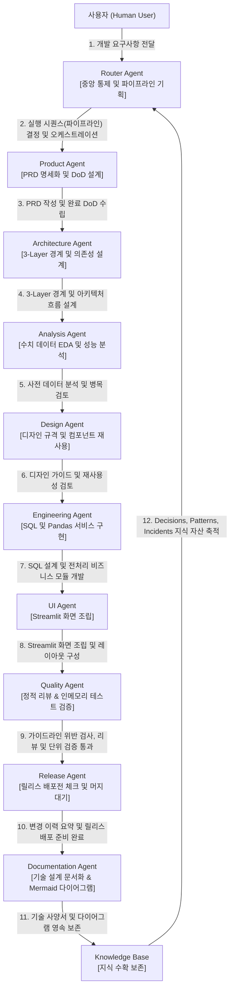

# 에이전트 OS 거버넌스 및 설계 헌법 (01_agent_governance_constitution.md - Level 1: Governance Constitution)

## Overview
* **왜 존재하는가 (Why)**: Agent OS 환경 내에 등록된 12대 전문 AI 에이전트 역할군의 페르소나 및 강제 허용/행동 규칙을 일원화하여 관리하기 위함입니다.
* **언제 사용하는가 (When)**: 신규 에이전트들을 기획/설계하거나, 각 에이전트 간의 동적 협업 동선을 확장하고 통제할 때 최상위 기준서로 참조합니다.
* **연계 실행 (Next Action)**: 각 에이전트별 구체적인 입력-출력(Input-Output) 데이터 명세 및 에이전트 간 연결 계약 구조를 상세히 확인하려면 중위 상세 사양서인 [02_agent_contract_specification.md](02_agent_contract_specification.md)를 연이어 대조 분석하십시오.

## Connections
* **상위 개념**: [AGENTS.md](../AGENTS.md)
* **하위 세부 명세**: [02_agent_contract_specification.md](02_agent_contract_specification.md) (Level 2: 입출력 계약 명세서)
* **연관 자산**: [agents_registry.json](agents_registry.json)
---

이 문서는 `agents/` (지능 및 페르소나 레이어) 고유의 로컬 규칙과 보유 파일 정보를 신속히 인지하기 위한 마이크로 가이드라인입니다.

본 문서는 인텔리전스 개정 표준에 의거하여 **프로젝트 내 모든 12대 에이전트의 역할 명세 및 오케스트레이션 라우팅 맵의 단일 진실 공급원(SSOT)** 역할을 전담 수행합니다.

## 1. 로컬 핵심 제약 (Local Rules)

* **순수 지능 격리 원칙 (No-Code Modification)**: 
  * 본 폴더에는 어떠한 파이썬 스크립트 등 **실행 가능한 소스 코드**를 둘 수 없습니다. (실행 가능한 도구 및 스크립트는 `.agents/skills/` 로 격리되어야 함)
  * 모든 파일은 에이전트의 정체성, 프롬프트, 위계 구성을 나타내는 마크다운(`.md`) 또는 JSON 포맷만 허용됩니다.
* **자동 동기화 프로토콜 준수**: 
  * 에이전트들의 역할 변경이나 메타데이터 변경 시, 반드시 `agents_registry.json`을 수정하고 본 문서 내의 에이전트 정보 표 및 다이어그램에 일관성 있게 반영하여 동기화 상태를 수동/자동 정비해야 합니다.

---

## 2. 활성 파일 목록 인덱스 (Active Files)

본 폴더 내에 활성화되어 보존 중인 핵심 에이전트 가이드 목록과 그 물리적 책임 규정은 다음과 같습니다. 모든 하이퍼링크는 WSL Markdown Link Constraint에 따라 워크스페이스 루트 기준 상대 경로로 연결됩니다.

| 파일명 (상대 경로 링크) | 파일의 본질적 역할 및 책임 (1줄 요약) |
| :--- | :--- |
| [agents_registry.json](agents_registry.json) | 에이전트 명세 및 Agy 표준 매니페스트 설정을 담은 단일 진실 공급원 (JSON) |
| [01_agent_governance_constitution.md](01_agent_governance_constitution.md) | (본 문서) 최상위 에이전트 거버넌스 및 설계 규칙 헌법 가이드 (Level 1) |
| [02_agent_contract_specification.md](02_agent_contract_specification.md) | 12대 정예 에이전트 데이터 입출력 계약 및 Chaining 사양서 (Level 2) |
| [roles/01_router-agent.md](roles/01_router-agent.md) | 오케스트레이션 파이프라인 수립 및 동적 라우팅 가동 가이드 (Level 3) |
| [roles/02_product-agent.md](roles/02_product-agent.md) | 비즈니스 요구사항 정의서(PRD) 및 완료 기준(DoD) 수립 가이드 (Level 3) |
| [roles/03_architecture-agent.md](roles/03_architecture-agent.md) | 3-Layer 경계 및 물리/논리 데이터 테이블 구조 설계 가이드 (Level 3) |
| [roles/04_analysis-agent.md](roles/04_analysis-agent.md) | 데이터 통계 이상치 진단 및 UI 렌더링 성능/병목 분석 가이드 (Level 3) |
| [roles/05_design-agent.md](roles/05_design-agent.md) | 미학적 디자인 규칙 및 기구축 컴포넌트 재사용성 감사 가이드 (Level 3) |
| [roles/06_engineering-agent.md](roles/06_engineering-agent.md) | Python, SQL 개발, 캐싱 서비스 전처리 및 자동화 스케줄 가이드 (Level 3) |
| [roles/07_ui-agent.md](roles/07_ui-agent.md) | Streamlit 레이아웃 화면 조립 및 세션 가로채기 개발 가이드 (Level 3) |
| [roles/08_quality-agent.md](roles/08_quality-agent.md) | 소스 코드 정적 스타일 리뷰 및 mock 격리 테스트 최종 검증 가이드 (Level 3) |
| [roles/09_release-agent.md](roles/09_release-agent.md) | 변경 사항 정리 및 릴리스 배포 준비 체크리스트 정렬 가이드 (Level 3) |
| [roles/10_documentation-agent.md](roles/10_documentation-agent.md) | 기술 사양서 보존 및 다이어그램(Mermaid) 문서화 기록 가이드 (Level 3) |
| [roles/11_prompt-agent.md](roles/11_prompt-agent.md) | 에이전트 행동 지침 프롬프트 최적화 및 압축 제어 가이드 (Level 3) |
| [roles/12_knowledge-base.md](roles/12_knowledge-base.md) | Decisions, Patterns, Incidents의 지식 자산 수확 보존 가이드 (Level 3) |

## 3. 에이전트 거버넌스 4대 위계 및 매니페스트 (Central Routing & Governance Table)

12대 고성능 에이전트 카탈로그 사상의 유기적 협업과 책임 한계를 명확히 규정하기 위해 전체 에이전트 OS를 **4대 전략적 거버넌스 레이어**로 일목요연하게 격리하여 운영합니다.

### ① 전략 및 조율 레이어 (Strategic & Coordination Tier)
* **`router-agent`**: 최소 지연 동적 바인딩(Lazy Loading) 조율, 실행 파이프라인 수립을 전담하는 중앙 순서 제어 오케스트레이터.
* **`product-agent`**: 제품 목표 및 기획(PRD), 완료 정의(DoD) 라이프사이클을 지휘하며 비즈니스 정합성을 보장하는 기획 에이전트.

### ② 구현 빌더 레이어 (Implementation Tier)
* **`architecture-agent`**: 시스템 구조, 3-Layer 아키텍처 경계, 데이터 테이블 스키마 및 의존성을 정립하는 설계 에이전트.
* **`design-agent`**: 디자인 가이드라인, 컬러 팔레트 및 재사용 가능한 컴포넌트 관리를 보장하는 디자인 에이전트.
* **`engineering-agent`**: Python, SQL, 데이터 전처리, 백그라운드 크론 자동화 및 리팩터링을 전담하는 개발 빌더 에이전트.
* **`ui-agent`**: Streamlit 화면 조립 및 사용자 세션 흐름을 구축하는 UI 빌더 에이전트.

### ③ 분석 및 품질 레이어 (Analytics & Quality Tier)
* **`analysis-agent`**: 수치 이상치 진단, YoY/MoM 통계분석 및 렌더링 지연 병목 진단을 전담하는 데이터 및 성능 분석 에이전트.
* **`quality-agent`**: 정적 코드 스타일 리뷰 피드백 작성, 인메모리 테스트 실행 및 최종 Pass/Fail 게이트를 통제하는 품질 에이전트.

### ④ 거버넌스 및 배포 레이어 (Governance & Deployment Tier)
* **`release-agent`**: 릴리스 변경 사항 정리 및 릴리스 배포전 체크리스트를 정렬하는 배포 에이전트.
* **`documentation-agent`**: 기술 문서 사양, API 명세서 및 다이어그램(Mermaid) 작성을 담당하는 문서화 에이전트.
* **`prompt-agent`**: 각 에이전트 프롬프트 튜닝 및 토큰 최적화를 제어하는 프롬프트 최적화 에이전트.
* **`knowledge-base`**: 주요 decisions, patterns, incidents의 수확 및 축적을 전담하는 지식 저장소 에이전트.

---

<!-- START_AGENT_TABLE -->
| Trigger | Agent | Required Context | Allowed Actions | Forbidden Actions | Verification | Output |
| :--- | :--- | :--- | :--- | :--- | :--- | :--- |
| **사용자 요청 유입 및 파이프라인 최적 설계** | `router-agent` | `router/routing_table_rules.json` | - 최소 지연 바인딩 및 파이프라인 수립 - 실행 에이전트 동적 바인딩 | - 비즈니스 PRD 설계 개입 금지 - 소스 코드 직접 수정 금지 | - 라우팅 규칙 준수 정합성 검증 | `.agents/agents/router-agent/*` |
| **목표 수립 및 DoD 요구사항 기획** | `product-agent` | `conventions/prd_standard_template.md` | - 제품 기획서(PRD) 작성 및 관리 - DoD 완료 성공 수식 상세 정의 | - 프로덕션 코드 직접 개발 금지 - DB 쿼리 전송 및 변경 금지 | - PRD 명세율 및 DoD 정합성 대조 | `.agents/context/prd/prd-*.md` |
| **3-Layer 레이어 통제 및 의존성 설계** | `architecture-agent` | `conventions/architecture.md` | - 3-Layer 경계 및 결합도 검증 설계 - 데이터 테이블 스펙 및 수식 설계 | - UI 위젯 직접 렌더링 작성 금지 - 승인 없이 패키지 독단 추가 금지 | - 순환 참조 및 레이어 침범 검증 | `.agents/context/architecture/*.md` |
| **데이터 및 성능 병목 통계 분석 리포터** | `analysis-agent` | - | - 수치 데이터 EDA 및 이상치 진단 - UI 지연, 캐시 누수, 쿼리 성능 정량 감사 | - 영구 데이터 임의 변조/수정 금지 - UI 레이아웃 직접 구현 금지 | - 분석 결과 정량 정합성 대조 | `.agents/context/analysis/*.json` |
| **디자인 규격 정립 및 컴포넌트 재사용 권고** | `design-agent` | `conventions/design_system.md` | - 컬러 토큰, 타이포그래요, 가이드 적용 - 기존 에셋 풀 재사용성 감사 및 권고 | - 백엔드 쿼리 설계 개입 금지 - 실제 DB 테이블 물리 설계 직접 금지 | - 디자인 가이드 일치성 정량 대조 | - |
| **SQL 쿼리 설계 및 데이터 전처리 개발** | `engineering-agent` | `conventions/coding_standards.md` | - `app/queries/` 내에 쿼리 함수 생성 및 수정 - `app/service/` 전처리 구현 및 자동화 스케줄 구축 | - 위젯 상태 불법 강제 수정 금지 - 기획서 검증 없는 임의 로직 개발 금지 | - pandas 예외처리 및 방어 연산 검증 | `app/queries/*` `app/service/*` |
| **Streamlit 화면 빌딩 및 세션 상태 제어** | `ui-agent` | `conventions/ui_standards.md` | - `app/pages/` 내 화면 레이아웃 구성 - 세션 가로채기를 이용한 세션 상태 처리 | - 복잡한 데이터 전처리 및 서비스 구현 금지 - 소스 코드 영역 이모지 직접 기입 금지 | - UI 정합성 및 화면 렌더링 검증 | `app/pages/*_page.py` |
| **정적 리뷰 피드백 및 테스트 품질 검증 게이트** | `quality-agent` | `conventions/testing_standards.md` | - 정적 코드 리뷰 및 피드백(Diff) 생성 - 단위 테스트 작성 및 인메모리 mocking 고립 테스트 수행 - 최종 Pass/Fail 합격 게이트 통제 | - 프로덕션 개발 코드를 직접 수정 금지 - 실제 DB 데이터를 훼손하는 테스트 엄격 금지 | - 테스트 구동 신뢰도 및 커버리지 검증 | `tests/*.py` `.agents/evals/*.md` |
| **릴리스 노트 작성 및 배포 보좌** | `release-agent` | - | - 변경 이력 요약 및 릴리스 노트 작성 - 배포 체크리스트 정비 및 최종 조율 | - 프로덕션 코드 임의 수정 금지 - 승인 없는 원격 강제 푸시 금지 | - 릴리스 명세서 정량 대조 | `.agents/evals/release-note-*.md` |
| **기술 설계 문서 및 다이어그램 영속 보존** | `documentation-agent` | - | - README, API 명세, 위키 작성 - 다이어그램(Mermaid) 구조 및 흐름 보존 | - 실행 코드의 직접적인 로직 개발 금지 | - WSL Markdown Link 정합성 린트 | `docs/**/*.md` `*.md` |
| **에이전트 제약 프롬프트 압축 최적화** | `prompt-agent` | - | - 에이전트별 행동 프롬프트 압축 튜닝 - 에이전트 설정 파일 정합성 조율 | - 비즈니스 프로덕션 개발 코드 개입 금지 | - 에이전트 프롬프트 적합도 검증 | `.agents/**/*.json` |
| **Decisions/Patterns/Incidents 지식 수확 보존** | `knowledge-base` | - | - 핵심 Decisions, Patterns, Incidents 기록 - 조건부 지식 수확 및 위키 연동 전파 | - 사소한 로컬 수정 무분별 수확 금지 | - 지식 구조화 및 링크 유효성 검증 | `knowledge/**/*.md` |
<!-- END_AGENT_TABLE -->

---

## 4. 예외 에스컬레이션 계약 (Escalation Protocol)

1. **품질 검증 실패 (`quality-agent` 판정 Fail)**: 품질 에이전트의 정적 검증 점수가 통과 기준 미만이거나 테스트 실패 시, 개발 빌더에게 회부하여 결함을 패치하도록 자동 에스컬레이션하고 최종 병합은 사람의 승인 하에 전면 대기합니다.
2. **보안 가이드라인 침해**: 코드 내 환경변수(DB 접속 정보, 비밀 토큰 등)가 하드코딩되거나 로그에 노출될 위험 감지 시 가차없이 실행을 중단합니다.
3. **리스크 위험도 최고 등급 (Risk Level: High)**: DB 마이그레이션이 수반되거나 권한 체계가 변동되는 패치는 절대 수동 검토 전 자동 승인 처리를 금지합니다.

---

## 5. 에이전트 협업 및 체이닝 (Agent Chaining Diagram)

아래 다이어그램은 **Router Agent**가 조율하는 6대 시나리오 중 가장 표준적인 **신규 분석 페이지 개발(New Analysis Page Development) 워크플로**의 협업 및 지식 자산 전파 다이내믹 흐름입니다.

<!-- START_AGENT_CHAINING -->

<!-- END_AGENT_CHAINING -->

---

## 6. 변경 이력 (Changelog)

* **2026-07-20** (본 수정을 반영):
  * [Refactor] 22대 대형 에이전트 카탈로그를 고성능 12대 에이전트 체제로 전격 통폐합 완료.
  * [Refactor] 스킬(Capability) 개념을 제거하고 에이전트(Responsibility) 중심으로 단순화 및 체질 개선.
  * [Doc] 신규 12대 에이전트 체제에 어울리도록 매니페스트 표 및 Mermaid 협업 흐름 다이어그램 리디자인 완료.
* **2026-07-03**:
  * [Refactor] 22대 대형 에이전트 카탈로그 사상을 전적으로 수렴하여 `01_agent_governance_constitution.md` 의 전 영역을 개편하고, 기존 7개 에이전트를 새로운 케밥 케이스 이름 체계로 일대 교정 마이그레이션 완료.
  * [Feat] 신설된 `router-agent` 폴더 내 동적 오케스트레이션 기획 두뇌(`routing_table_prompt.md`) 및 판단 규칙(`routing_table_rules.json`, `review_criteria_rules.json`)과의 정합성 링크를 구축 완료.
  * [Refactor] 22대 에이전트의 유기적 협업 흐름을 반영하도록 Mermaid 다이어그램 전격 리디자인 완료.
