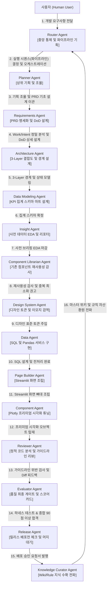

# agents.md (에이전트 규정)

## Overview
* **왜 존재하는가 (Why)**: Agent OS 환경 내에 등록된 22대 전문 AI 에이전트 역할군의 페르소나 및 강제 허용/행동 규칙을 일원화하여 관리하기 위함입니다.
* **언제 사용하는가 (When)**: 신규 에이전트들을 기획/설계하거나, 각 에이전트 간의 동적 협업 동선을 확장하고 통제할 때 사용합니다.
* **연계 실행 (Next Action)**: 에이전트별 필수 스킬 맵핑을 다루는 [agents/skill-map.md](skill-map.md)를 함께 열어 분석하십시오.

## Connections
* **상위 개념**: [AGENTS.md](../AGENTS.md)
* **연관 자산**: [agents/skill-map.md](skill-map.md) | [agents/agents_registry.json](agents_registry.json)
---

이 문서는 `agents/` (지능 및 페르소나 레이어) 고유의 로컬 규칙과 보유 파일 정보를 신속히 인지하기 위한 마이크로 가이드라인입니다.

본 문서는 인텔리전스 개정 표준에 의거하여 **프로젝트 내 모든 22대 에이전트의 역할 명세 및 오케스트레이션 라우팅 맵의 단일 진실 공급원(SSOT)** 역할을 전담 수행합니다.

## 1. 로컬 핵심 제약 (Local Rules)

* **순수 지능 격리 원칙 (No-Code Modification)**: 
  * 본 폴더에는 어떠한 파이썬 스크립트 등 **실행 가능한 소스 코드**를 둘 수 없습니다. (실행 가능한 도구 및 스크립트는 `.agents/skills/` 로 격리되어야 함)
  * 모든 파일은 에이전트의 정체성, 프롬프트, 위계 구성을 나타내는 마크다운(`.md`) 또는 JSON 포맷만 허용됩니다.
* **자동 동기화 프로토콜 준수**: 
  * 에이전트들의 역할 변경이나 메타데이터 변경 시, 반드시 `agents_registry.json`을 수정하고 본 문서 내의 에이전트 정보 표 및 다이어그램에 일관성 있게 반영하여 동기화 상태를 수동/자동 정비해야 합니다.

---

## 2. 활성 파일 목록 인덱스 (Active Files)

본 폴더 내에 활성화되어 보존 중인 핵심 에이전트 가이드 목록과 그 물리적 책임 규정은 다음과 같습니다. 모든 하이퍼링크는 WSL Markdown Link Constraint에 따라 워크스페이스 루트 기준 상대 경로로 연결됩니다.

| 파일명 (상대 경로 링크) | 파일의 본질적 역할 및 책임 (1줄 요약) |
| :--- | :--- |
| [agents_registry.json](agents_registry.json) | 에이전트 명세 및 Agy 표준 매니페스트 설정을 담은 단일 진실 공급원 (JSON) |
| [roles/planner-agent.md](roles/planner-agent.md) | 최상위 분석 요구사항 기획 및 PRD 기초 설계를 통제하는 기획자 가이드 |
| [roles/data-agent.md](roles/data-agent.md) | SQL 최적화 쿼리 및 Pandas 캐싱 서비스 레이어 전처리를 담당하는 데이터 빌더 가이드 |
| [roles/page-builder-agent.md](roles/page-builder-agent.md) | Streamlit 화면 조립, 세션 상태 및 공통 CSS 인젝션을 연동하는 UI 빌더 가이드 |
| [roles/insight-agent.md](roles/insight-agent.md) | 신설 데이터 테이블 통계분석(EDA) 및 정량/정성 브리핑 리포트를 발행하는 분석가 가이드 |
| [roles/project-health-agent.md](roles/project-health-agent.md) | 코드 명명 준수율, 아키텍처 결합도 및 DB 스키마-코드 1:1 정합성을 검역하는 가이드 |
| [roles/reviewer-agent.md](roles/reviewer-agent.md) | 파이썬 소스 코드 정적 정합성, 보안 취약성 및 가이드라인 위반 Diff를 피드백하는 리뷰어 가이드 |
| [roles/evaluator-agent.md](roles/evaluator-agent.md) | 하네스 테스트 자율 구동 및 이터레이션 성공 정량 스코어카드를 발행하는 최종 평가자 가이드 |
| [router-agent/routing_table_rules.json](router-agent/routing_table_rules.json) | 6대 주요 시나리오에 부합하는 에이전트 라우팅 테이블 판단 JSON 규칙서 |
| [router-agent/routing_table_prompt.md](router-agent/routing_table_prompt.md) | 다이내믹 최소 지연 바인딩(Lazy Loading) 조율을 통제하는 라우터 기획 두뇌서 |

---

## 3. 에이전트 거버넌스 4대 위계 및 매니페스트 (Central Routing & Governance Table)

22대 대형 에이전트 카탈로그 사상의 유기적 협업과 책임 한계를 명확히 규정하기 위해 전체 에이전트 OS를 **4대 전략적 거버넌스 레이어**로 일목요연하게 격리하여 운영합니다.

### ① 전략 및 조율 레이어 (Strategic & Coordination Tier)
* **`router-agent`**: 최소 지연 동적 바인딩(Lazy Loading) 조율, 실행 파이프라인 수립을 전담하는 중앙 순서 제어 오케스트레이터. (절대 직접 분석하지 않음)
* **`planner-agent`**: 제품 요구사항 정의서(PRD)의 라이프사이클을 총괄 지휘하며 사용자와 기획적 가치를 수렴하는 최상위 의사소통자.
* **`requirements-agent`**: 사용자 요청의 Work/Intent 정밀 분석 및 분류, 비기능/기능 요구사항 구체화, 에이전트 실행 성공 완료 정의(DoD) 지표 설계자.
* **`architecture-agent`**: Presentation, Service, Query의 3-Layer 경계와 컴포넌트 간 순환 참조 종속성 감시 아키텍트.

### ② 구현 빌더 레이어 (Implementation Tier)
* **`data-modeling-agent`**: 집계 분석 마트, Fact, Dimension 컬럼 스펙 및 집계 계산 수식 모델러.
* **`data-agent`**: 쿼리 레이어 SQL 구현 및 Pandas 전처리, `@st.cache_data` 서비스 모듈화 빌더.
* **`page-builder-agent`**: Streamlit 화면 조립, 테마 CSS 주입, 세션 가로채기 제어 빌더. (데이터 전처리 직접 가공 차단)
* **`component-agent`**: 프리미엄 Plotly 반응형 차트 튜닝, 메트릭 카드 시각화 빌더.
* **`refactoring-agent`**: 코드 다이어트, 공통 모듈 정립 및 3-Layer 전향 배치 전문 빌더.
* **`automation-agent`**: 백그라운드 크론 스케줄, 이메일 알림 및 webhook 연동 자동화 빌더.
* **`test-agent`**: 테스트 케이스 설계, 인메모리(In-Memory) mocking 기반 고립 테스트 전담 엔지니어.

### ③ 분석 및 정적 품질 레이어 (Analytics & Quality Tier)
* **`insight-agent`**: 신설 데이터의 이상치(Anomaly) 진단, YoY/MoM 통계분석 및 정성 브리핑 리포트 분석가.
* **`reviewer-agent`**: 소스 코드 스타일, 3-Layer 규칙 준수율, 보안 취약점 정적 검역관.
* **`project-health-agent`**: 변수 명명 규칙 준수율 정량 감사, DB 테이블 상수 동기화 진단가.
* **`performance-agent`**: 렌더링 지연 유발 rerun, 캐시 누수, 쿼리 병목 정량 진단가.

### ④ 거버넌스 및 배포 레이어 (Governance & Deployment Tier)
* **`evaluator-agent`**: 테스트 커버리지 및 종합 린트 채점표(Scorecard)를 발행하여 최종 Pass/Fail 게이트를 판정하는 최종 판관.
* **`release-agent`**: 릴리스 준비 체크리스트 정렬, 릴리스 노트 작성 및 수동 머지 정렬 보좌관.
* **`knowledge-curator-agent`**: 마감된 설계 가치의 위키(Wiki) 자율 수확 및 Graphify 동기화 사서.
* **`documentation-agent`**: 기술 설계 문서, API 스펙, ADR 마크다운 정밀 기록 사서.
* **`prompt-optimizer-agent`**: 에이전트별 행동 제약 프롬프트 토큰 압축 및 지침 자율 튜닝 지능 전담자.

---

<!-- START_AGENT_TABLE -->
| Trigger | Agent | Required Context | Allowed Actions | Forbidden Actions | Verification | Output |
| :--- | :--- | :--- | :--- | :--- | :--- | :--- |
| **사용자 요청 최초 유입 및 파이프라인 최적 설계 [중앙 오케스트레이터]** | `router-agent` *(Router Agent)* | `router/05_router_architecture.md` `routing_table_rules.json` | - 최소 지연 바인딩(Lazy Loading) 및 사전 재사용성 대조 기획 - 동적 에이전트 실행 순서(파이프라인 시퀀스) 수립 | - 사용자 요청의 Work/Intent 분석 및 분류 전면 금지 - 프로덕션 개발 코드 직접 수정 금지 - 세부 비즈니스 PRD 설계 개입 금지 | - 라우팅 규칙 준수 정합성 검증 - 불필요 에이전트 생략 정당성 확인 | `.agents/agents/router-agent/*` |
| **사용자 요구사항 수집 및 기초 작업 계획 수립 [최상위 기획 에이전트]** | `planner-agent` *(Planner Agent)* | `L2-architecture.md` `prd-template.md` | - 상위 수준의 이터레이션 기획안 도출 - 비전 및 운영 헌법 부합 여부 선제 점검 | - 프로덕션 소스 코드 직접 개발 및 수정 금지 - DB 쿼리 전송 및 데이터 변조 차단 | - 상위 설계서 포맷 및 위계 준수율 | `.agents/context/prd/prd-*.md` |
| **비즈니스 기능 세부 명세 및 DoD 성공 기준 수립 [비즈니스 기획 에이전트]** | `requirements-agent` *(Requirements Agent)* | `prd-template.md` | - 사용자 요청의 11대 Work 및 9대 Intent 정밀 분석 및 분류 - 기능/비기능 요구사항 상세 정의 - 하위 에이전트 구동 성공 기준(DoD) 정밀화 | - 시스템 물리 아키텍처 개입 불가 - DB 테이블 스키마 물리적 정의 금지 | - PRD 명세서의 완성도 및 정합성 검사 | `.agents/context/prd/prd-*.md` |
| **3-Layer 레이어 경계 통제 및 컴포넌트 의존성 설계 [아키텍트 에이전트]** | `architecture-agent` *(Architecture Agent)* | `L2-architecture.md` | - 신규 페이지의 컴포넌트 경계 구획 - 데이터 레이어와 UI 레이저 간 흐름 설계 | - 세부 쿼리 및 Streamlit 코드 단독 개발 금지 - 비즈니스 PRD 요구 조건 변형 금지 | - 3-Layer 결합도 및 순환참조 유무 검증 | `.agents/context/architecture/design-*.md` |
| **Fact/Dimension 도출 및 품질 메트릭 집계 마트 설계 [데이터 모델러 에이전트]** | `data-modeling-agent` *(Data Modeling Agent)* | `L2-architecture.md` `L3-query.md` | - 집계 마트 컬럼 명세 및 수식 설계 - 데이터 파이프라인 흐름 최적화 설계 | - UI 컴포넌트 및 프론트엔드 전처리 소스 작성 금지 | - 컬럼 및 스키마 물리적 정합성 대조 | `.agents/context/data/schema-*.md` |
| **SQL 쿼리 설계 및 데이터 전처리 개발 [데이터 빌더 에이전트]** | `data-agent` *(Data Agent)* | `L2-architecture.md` `L3-query.md` `L3-service.md` | - `app/queries/` 내에 쿼리 함수 생성 및 수정 - `app/service/` 내에 데이터 전처리, 정제 및 `@st.cache_data` 부착 개발 | - `app/pages/` 내의 UI 파일이나 시각화(`_plots.py`) 직접 수정 금지 - 화면 컨트롤러 설계 개입 금지 | - pandas 예외처리 및 방어 연산 검증 - 쿼리 병목 정밀 분석 통과율 | `app/queries/*_query.py` `app/service/*_df.py` |
| **신규 테이블 등록 시 사전 브리핑 및 EDA [도메인 분석 에이전트]** | `insight-agent` *(Insight Agent)* | `L2-architecture.md` | - 테이블의 데이터 통계분석 및 이상치 진단 - 수치 이면의 비즈니스 현실 및 해석 브리핑 리포트 생성 및 영속 보존 | - 프로덕션 코드 직접 작성 및 수정 엄격 금지 - DB 데이터 변조/변경 및 파괴적 쿼리 차단 | - 리포트 내 결측치 및 비즈니스 인과 분석 유효성 대조 | `.agents/context/domain/eda-*.md` |
| **Streamlit 화면 빌딩 및 세션 상태 관리 제어 [UI 빌더 에이전트]** | `page-builder-agent` *(Page Builder Agent)* | `L2-architecture.md` `L3-dashboard.md` `L2-business-constants.md` | - `app/pages/` 내에 Streamlit 레이아웃 구성 및 세션 상태 관리 - `app/core/page/config_pages.py`에 네비게이션 매핑 및 자동 등록 - CSS 인젝션 구문의 Minified 포맷팅 및 주석 자동 제거 패치 | - `app/queries/` 및 `app/service/` 모듈 직접 수정 금지 - UI 내에 무거운 전처리 연산 직접 코딩 금지 - UI 페이지, 주석 등 소스 영역에서 일반 유니코드 이모지 직접 기입 엄격 금지 | - 3-Layer 정합성 대조 및 페이지 레이아웃 무결성 검증 | `app/pages/*_page.py` `app/core/page/config_pages.py` |
| **Plotly 프리미엄 시각화 및 미학적 세부 컴포넌트 개발 [시각화 빌더 에이전트]** | `component-agent` *(Component Agent)* | `L3-plot.md` `L2-color-system.md` | - 프리미엄 Plotly Figure(`apply_premium_chart_theme`) 일치성 보장 - 시각화 객체의 반응형 차원 설정 및 미학적 하모니 튜닝 | - UI 프레임워크 자체 배치 코드 및 쿼리 캐시 수정 금지 | - 차트 렌더링 정상 동작 및 미학적 디테일 검역 | `app/pages/*_plots.py` |
| **아키텍처 및 3-Layer 정적 코드 리뷰 수행 [지식 검역관 에이전트]** | `reviewer-agent` *(Reviewer Agent)* | `code-reviewer.md` `L2-architecture.md` `L2-naming-convention.md` `checklist/checklist-release.md` `checklist/checklist-security.md` | - 빌더가 완성한 파이썬 소스 코드 정적 정합성 및 잠재 버그 분석 - 아키텍처 규칙 위반 탐지 시 리팩토링 개선 가이드(Diff) 제안 생성 | - 프로덕션 소스 코드 직접 강제 덮어쓰기 금지 - 최종 Pass/Fail 합격 여부 독단 결정 금지 | - 리뷰 리포트 규격 및 제시한 리팩토링 가이드(Diff) 무결성 대조 | `.agents/evals/review-report-*.md` |
| **하네스 테스트 구동 및 품질 평점 채점 관리 [품질 최종 게이트]** | `evaluator-agent` *(Evaluator Agent)* | `quality-evaluator.md` `L2-architecture.md` `prd-*.md` | - `tests/` 하위 테스트 케이스 자율 구동 및 감시 - `make verify` 구문/린트 스코어 산출 및 요구사항 충족도 매핑 채점 - 게이트 합격/불합격(Pass/Fail) 판단 강제 수립 | - 프로덕션 소스 코드 및 테스트 코드 직접 수정 금지 - 오류 발생 시 리팩토링 코드 직접 작성 금지 | - 테스트 구동 신뢰도 및 정량 스코어 계산 무결성 | `.agents/evals/evaluation-scorecard-*.md` |
| **코드 명명 정합성 검사 및 스키마-코드 사전 관리 [정량 감사 에이전트]** | `project-health-agent` *(Project Health Agent)* | `L2-naming-convention.md` `L2-business-constants.md` | - 아키텍처 중복률, 준수율 지표 수치 감사 - DB 테이블 상수 변경 자동 감지 및 `query_tables_metadata.json` 정보 연동 | - 프로덕션 소스 코드 직접 생성 및 임의 변경 금지 | - 명명 규정 위반 탐지 정밀도 및 상수 정합성 검증 | `.agents/context/infra/project-health-report.json` |
| **지식 영속화 및 Wiki/Rule 자산 수확 [지식 축적 에이전트]** | `knowledge-curator-agent` *(Knowledge Curator Agent)* | `philosophy/01_principles.md` | - 성공 완료된 이터레이션의 설계 가치 수확 - Wiki 린트 검증 및 지식 그래프 자율 연동 배포 | - 완수되지 않은 미완의 코드/문서 가치 병합 차단 | - 위키 링크 및 Frontmatter WSL 상대 경로 정합성 린트 | `.agents/wiki/*` `.agents/rules/*` |
<!-- END_AGENT_TABLE -->

---

## 4. 예외 에스컬레이션 계약 (Escalation Protocol)

모든 에이전트는 다음 예외 조항 발생 시 즉시 자율 동작을 멈추고 사람(수동 관리자)에게 통제권을 인계해야 합니다.

1. **품질 검증 실패 (`evaluator-agent` 판정 Fail)**: 평가 에이전트의 품질 스코어가 90점 미만이거나 하네스 테스트 실패 시, 개발 빌더 및 리뷰어에게 회부하여 결함을 패치하도록 자동 에스컬레이션하고 최종 병합은 사람의 승인 하에 전면 대기합니다.
2. **보안 가이드라인 침해**: 코드 내 환경변수(DB 접속 정보, 비밀 토큰 등)가 하드코딩되거나 로그에 노출될 위험 감지 시 가차없이 실행을 중단합니다.
3. **리스크 위험도 최고 등급 (Risk Level: High)**: DB 마이그레이션이 수반되거나 권한 체계가 변동되는 패치는 절대 수동 검토 전 자동 승인 처리를 금지합니다.

---

## 5. 에이전트 협업 및 체이닝 (Agent Chaining Diagram)

아래 다이어그램은 **Router Agent**가 조율하는 6대 시나리오 중 가장 표준적이고 복잡한 **신규 분석 페이지 개발(New Analysis Page Development) 워크플로**의 협업 및 지식 자산 전파 다이내믹 흐름입니다.

<!-- START_AGENT_CHAINING -->

<!-- END_AGENT_CHAINING -->

---

## 6. 변경 이력 (Changelog)

* **2026-07-03** (본 수정을 반영):
  * [Refactor] 22대 대형 에이전트 카탈로그 사상을 전적으로 수렴하여 `agents.md` 의 전 영역을 개편하고, 기존 7개 에이전트를 새로운 케밥 케이스 이름 체계로 일대 교정 마이그레이션 완료.
  * [Feat] 신설된 `router-agent` 폴더 내 동적 오케스트레이션 기획 두뇌(`routing_table_prompt.md`) 및 판단 규칙(`routing_table_rules.json`, `review_criteria_rules.json`)과의 정합성 링크를 구축 완료.
  * [Refactor] 22대 에이전트의 유기적 협업 흐름을 반영하도록 Mermaid 다이어그램 전격 리디자인 완료.
* **2026-06-24**:
  * [Refactor] `agents.md` 내부에 남아있던 과거 `intelligence/` 절대/상대 경로 흔적을 완전히 정리하고 `.agents/agents/` 실제 디렉토리 구조로 일관성 있게 전면 개정.
