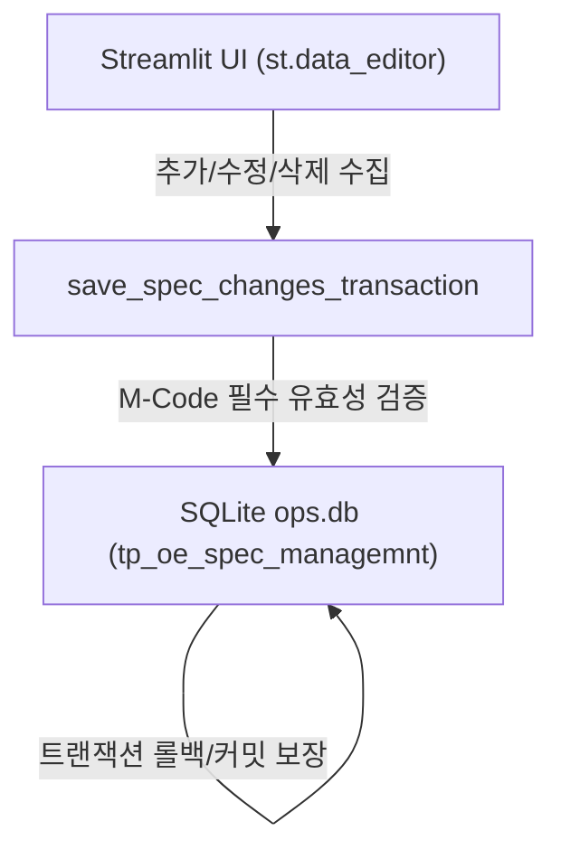

# M-Code List 관리 시스템 전환 설계서

본 문서는 tp_oe_spec_managemnt 테이블을 기존의 다중 공정 스펙 구조에서 핵심 마스터 코드인 **M-Code 리스트**만을 초단순하게 관리하는 시스템으로 전면 리팩토링하기 위한 통합 아키텍처 및 데이터 흐름 설계서입니다.

---

## 1. 아키텍처 개요 (Architecture Overview)

기존 시스템의 스키마 제약과 많은 비필수 컬럼들을 제거하고, 오직 마스터 M-Code와 해당 코드의 비고(Remark) 정보만을 안전하게 조작할 수 있는 일괄 원자적 트랜잭션 관리 레이어를 재구축합니다.



---

## 2. 데이터베이스 DDL 스펙 (Database Schema)

테이블명 `tp_oe_spec_managemnt`는 기존 시스템과의 정합성을 위해 그대로 유지하되, 내부 컬럼을 비즈니스 요구에 맞추어 초단순 형태로 리빌딩합니다.

```sql
CREATE TABLE tp_oe_spec_managemnt (
    id INTEGER PRIMARY KEY AUTOINCREMENT,
    m_code TEXT NOT NULL UNIQUE,
    remark TEXT,
    created_at TIMESTAMP DEFAULT CURRENT_TIMESTAMP,
    updated_at TIMESTAMP DEFAULT CURRENT_TIMESTAMP
);
```

### 주요 변경 및 보완 제약:
* **m_code (TEXT, UNIQUE)**: 비어 있을 수 없으며(NOT NULL), 마스터 코드의 무결성 보호를 위해 중복 등록이 금지(UNIQUE)됩니다.
* **remark (TEXT)**: M-Code에 대한 세부 정의나 비고 내용을 선택 입력할 수 있습니다.

---

## 3. 백엔드 및 트랜잭션 컨트롤러 설계 (Backend Controller)

* **트랜잭션 동기화 엔진**: `save_spec_changes_transaction(added_list, edited_dict, deleted_list)`
  - **유효성 검증 (Validation)**:
    - 신규 행 추가 시 `m_code` 누락 여부 및 공백 데이터 검출.
    - `m_code` 중복 예외 발생 시 상위로 전파 및 트랜잭션 롤백 처리.
  - **작업 원자성 보장**:
    - SQLite 커넥션 하에서 `BEGIN TRANSACTION`, `COMMIT`, `ROLLBACK` 흐름을 명확하게 제어합니다.
    - 단 1건의 수정/추가 실패 혹은 필수 필드 누락 시에도 트랜잭션 전체를 취소(Rollback)하여 DB를 이전 상태로 완전히 원복시킵니다.

---

## 4. UI 렌더링 및 세션 상태 복구 설계 (Streamlit UI Design)

* **컬럼 렌더링 설정 (Column Config)**:
  - `id`: 비활성화 및 정수 포맷 (`format="%d"`).
  - `m_code`: 수정 및 추가 활성화, 고유 툴팁 제공 (`help="관리 대상이 되는 핵심 M-Code를 입력하세요."`).
  - `remark`: 비고 란 텍คาร 영역 제공.
  - `created_at` / `updated_at`: 비활성화된 생성/수정 날짜.
* **세션 가로채기 (Session Interception)**:
  - 변경사항 저장 성공 또는 취소 클릭 시 `st.session_state`에서 `st.data_editor` 전용 상태 캐시 키를 `pop()` 소거하고 `st.rerun()`을 호출함으로써 위젯을 완전히 재구동 및 깔끔히 클리어합니다.

---

## 5. 단위 검증 시나리오 (Verification & TDD Plans)

1. **테스트 케이스 1: 성공 시나리오 (Success Commit)**:
   - 신규 M-Code 추가 및 기존 Remark 수정 발생 시, SQLite에 한 트랜잭션으로 안전하게 커밋되고 `id` 기반 데이터 정합성이 일치하는지 조감합니다.
2. **테스트 케이스 2: 실패 및 롤백 시나리오 (Rollback)**:
   - `m_code` 필수값 누락이나 이미 존재하는 동일 `m_code` 중복 입력 시, 원자적 롤백이 동작하여 기존 데이터가 전혀 변조되지 않음을 검증합니다.
