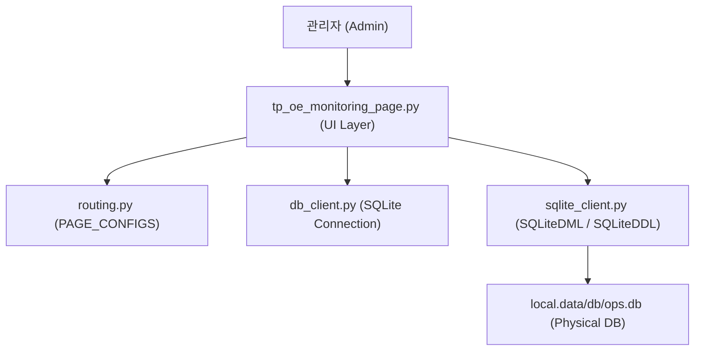
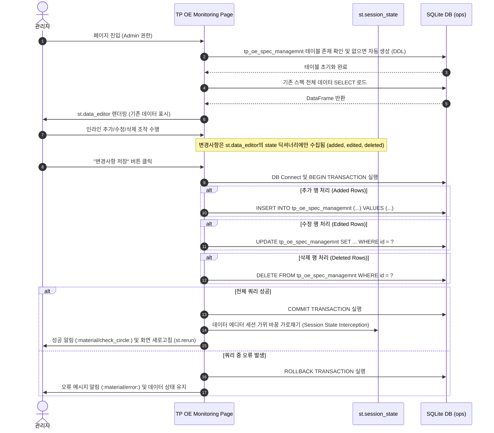

# [Design Spec] Admin Console - TP OE Monitoring & Spec Management

## 1. 개요 (Introduction)
본 문서는 CQMS(Customer Quality Management System) 애플리케이션의 Admin Console 카테고리에 새로운 관리자 전용 페이지인 **"TP OE Monitoring"**을 추가하고, 이와 연동되는 **`tp_oe_spec_managemnt`** SQLite `ops` 테이블의 데이터 에디팅 시스템을 구현하기 위한 상세 아키텍처 및 데이터 흐름 설계 사양서입니다.

---

## 2. 요구사항 정의 (Requirements Definition)
* **네비게이션 라우팅**: "Admin Console" 카테고리에 "TP OE Monitoring" 페이지를 배치합니다.
* **접근 권한 제한**: 오직 `Admin` 역할을 가진 관리자만 접근 및 조작할 수 있도록 제한합니다.
* **데이터베이스 및 테이블**: 
  * 로컬 SQLite `ops` 데이터베이스 파일 내에 `tp_oe_spec_managemnt` 테이블을 둡니다. (사용자 지정 고유 명칭 엄격 유지)
  * 애플리케이션 혹은 페이지 최초 로드 시 테이블의 부재를 감지하고 자동으로 안전하게 초기 스키마를 구성하는 자가 복구 기능을 갖춥니다.
* **데이터 에디팅 사용자 경험 (Option A - 트랜잭션 수동 커밋)**:
  * Streamlit의 `st.data_editor`를 활용하여 데이터를 테이블 형식으로 조회 및 인라인 수정(추가, 편집, 삭제)할 수 있도록 합니다.
  * 조작 중에는 실제 DB에 반영되지 않으며, 변경사항 목록이 대기 상태로 유지됩니다.
  * 하단의 "변경사항 저장" 버튼을 눌렀을 때만 원자적(Atomic) 트랜잭션을 실행하여 일괄 업데이트를 완결합니다.
  * 오류가 단 하나라도 발생하는 경우, 트랜잭션 전체를 `ROLLBACK`하여 정합성을 수호합니다.
  * 완료 시 또는 리셋 시, 에디터의 상태를 정상적으로 클리어하기 위해 위젯 인스턴스화 이전 세션을 초기화하는 세션 가로채기(Session Interception) 패턴을 적용합니다.

---

## 3. 물리 데이터베이스 설계 (Physical Schema Design)
SQLite `ops` 데이터베이스(`SQLITE_DB_OPS_PATH`) 하위에 구축될 물리 테이블 스키마 사양입니다.

### 테이블명: `tp_oe_spec_managemnt`

| 컬럼명 | 데이터 타입 | 제약 조건 | 설명 |
| :--- | :--- | :--- | :--- |
| `id` | `INTEGER` | `PRIMARY KEY AUTOINCREMENT` | 고유 행 인덱스 |
| `factory` | `TEXT` | `NOT NULL` | 공장 코드 (예: H1, H2, G1) |
| `spec_group` | `TEXT` | `NOT NULL` | 스펙 대분류 / 그룹 |
| `spec_name` | `TEXT` | `NOT NULL` | 세부 스펙 항목명 |
| `target_val` | `REAL` | | 기준 목표치 (Nominal Target) |
| `lcl` | `REAL` | | 관리 하한선 (Lower Control Limit) |
| `ucl` | `REAL` | | 관리 상한선 (Upper Control Limit) |
| `unit` | `TEXT` | | 측정 단위 (예: psi, mm, kgf) |
| `remark` | `TEXT` | | 비고 / 수정 사유 기록 |
| `created_at` | `TIMESTAMP` | `DEFAULT CURRENT_TIMESTAMP` | 레코드 최초 생성 일시 |
| `updated_at` | `TIMESTAMP` | `DEFAULT CURRENT_TIMESTAMP` | 레코드 최종 수정 일시 |

---

## 4. 아키텍처 및 데이터 흐름 (Architecture & Data Flow)

### 4.1. 시스템 컴포넌트 의존성


### 4.2. 트랜잭션 일괄 저장 및 세션 복구 흐름 (Option A)


---

## 5. 구현 세부 설계 (Detailed Implementation Specs)

### 5.1. 라우팅 테이블 등록 (`app/core/infrastructure/routing.py`)
`PAGE_CONFIGS` 사전에 아래 설정을 추가하여 Admin Console 하위 메뉴로 신규 페이지를 공식 인코딩합니다.
```python
    "TP OE Monitoring": {
        "filename": "app/pages/_80_admin/tp_oe_monitoring_page.py",
        "icon": ":material/monitor_heart:",
        "category": "Admin Console",
        "roles": ["Admin"],
    },
```

### 5.2. 트랜잭션 프로세서 로직 (`tp_oe_monitoring_page.py`)
`st.data_editor`에서 넘겨받는 변경사항 컬렉션을 정밀 가공하여 SQLite 원자적 트랜잭션으로 커밋하는 비즈니스 컨트롤러를 격리 선언합니다.

```python
# =========================================================================
# SECTION 3. Database Sync Controller (데이터베이스 동기화 컨트롤러)
# =========================================================================
def save_spec_changes_transaction(
    added_list: list[dict], 
    edited_dict: dict[str, dict], 
    deleted_list: list[int]
) -> tuple[bool, str]:
    """데이터 에디터의 가공 정보들을 단일 트랜잭션으로 묶어 SQLite DB에 동기화합니다.

    Args:
        added_list (list[dict]): 신규 추가될 레코드 데이터 목록
        edited_dict (dict[str, dict]): 수정될 레코드 정보 (key: id_str, val: {col: val})
        deleted_list (list[int]): 삭제될 레코드 고유 ID 목록

    Returns:
        tuple[bool, str]: (성공 여부, 결과 메시지)
    """
    # 원자적 데이터 정합성 보증을 위해 sqlite3 라이브러리를 직접 호출하여 컨텍스트 통제
    # ...
```

### 5.3. 세션 가로채기 초기화 (Session Interception)
Streamlit의 `st.data_editor` 위젯은 내부 편집 상태 캐시가 `key` 상태에 속박되므로, 저장이 완료되거나 사용자가 수동으로 리셋하려 할 때 위젯 생성 직전 해당 `key`를 `st.session_state`에서 완전히 소거(POP)한 뒤, `st.rerun()`으로 화면을 강제 복구함으로써 런타임 캐시 꼬임 현상을 완전히 방지합니다.

---

## 6. 품질 검증 및 안전 기준 (Verification & Safety Standards)
1. **Safety Lock 준수**: 변경이 필요함을 탐지했으나 기존 `app.py` 소스 코드는 일절 손대지 않으며 오직 명시된 라우팅 파일 `routing.py`에 키-밸리 한 블록을 주입하는 작업과 신규 페이지 파일인 `tp_oe_monitoring_page.py` 생성 작업만 수행하여 하네스 샌드박스 정합성을 확보합니다.
2. **이모지 전면 금지 규정**:
   * 마크다운 텍스트, 주석 및 UI 버튼 라벨에 유니코드 이모티콘 사용을 철저히 금지합니다.
   * 성공 표시는 `:material/check_circle:`, 에러 및 위기 알림은 `:material/error:` 또는 `:material/warning:` 구문만을 사용하여 고품질 테마를 구현합니다.
3. **독스트링 한글화 지침**: 새로 선언될 모듈 및 함수 내부에 타입 힌팅과 함께 한글 구글/NumPy 스타일의 독스트링을 명확히 주입하여 소스코드 품질과 지속 가독성을 극대화합니다.
