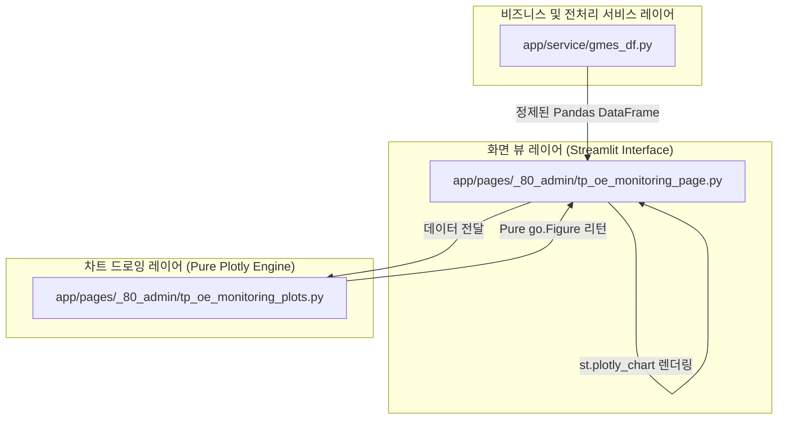

# TP OE Monitoring 대시보드 탭 신설 및 사이드바 통합 설계서

본 문서는 사용자의 요청에 따라 TP OE Monitoring 관리자 대시보드 화면의 필터 제어 환경을 직관적인 좌측 사이드바로 일원화하고, 첫 번째 탭에 생산/품질을 총망라하는 **종합 실시간 모니터링 대시보드**를 추가하기 위해 설계된 단일 진실 공급원(SSOT) 아키텍처 명세서입니다.

---

## 1. 개요 및 배경 (Background)
* **왜 개발하는가 (Why)**: 
  * 기존 상단 컨테이너 필터 레이아웃은 수직 영역을 많이 차지하여 실시간 데이터를 조회했을 때 테이블의 스크롤 시인성을 해쳤습니다.
  * 데이터프레임 그리드로만 나열되던 원시 생산 및 품질 데이터를 프리미엄 수준의 요약 메트릭(KPI)과 세련된 혼합 차트로 입체화하여 즉각적인 분석 의사결정을 유도합니다.
* **언제 사용하는가 (When)**: 
  * 공장 관리자 및 개발자가 TP OE 제품군의 실시간 실적(GMES)과 종합 품질 지표(Scrap, Rework, Uniformity)의 일치 수준을 직관적으로 관측할 때 상시 사용합니다.

---

## 2. 아키텍처 및 모듈 격리 설계 (Isolation Architecture)

시각화 품질 및 클린 아키텍처의 결합도 제어를 위해 **[L3-plot.md](L3-plot.md)** 규정을 준수하여 뷰 레이어와 차트 드로잉 엔진을 엄격하게 분리합니다.



### ① 뷰 레이어 (`tp_oe_monitoring_page.py`)
* **역할**: 좌측 사이드바 필터를 통해 사용자의 조회 조작 이벤트를 접수하고, 서비스 레이어로부터 정제된 데이터프레임을 주입받아 대시보드 메트릭 카드 및 탭 구조를 최종 렌더링합니다.
* **제약**: Plotly 차트를 직접 그리기 위한 개별 Trace 가속 코드를 배제하고, `tp_oe_monitoring_plots.py`에서 빌드된 Figure 객체만을 위임받아 단순 드로잉합니다.

### ② 플롯 레이어 (`tp_oe_monitoring_plots.py`)
* **역할**: Pandas DataFrame을 수신하여 호버(hover), 색상(시맨틱), 격자, 폰트를 적용한 순수 Plotly Figure를 생성하여 반환합니다.
* **제약**: 파일 내에 `import streamlit`을 철저히 불허하여 UI 호출 부작용을 원천 격리합니다.

---

## 3. 세부 화면 레이아웃 정의 (Wireframe & Layout)

### ① 좌측 사이드바 (`st.sidebar`) 필터 통합
* 기존 상단의 조회 조건 설정 컨테이너를 제거하고 왼쪽 사이드바 영역으로 이전합니다.
* 구성 요소:
  1. **조회 기준 일자** (`st.sidebar.date_input`)
  2. **스펙 구분 (Spec FG)** (`st.sidebar.selectbox`)
  3. **스펙 타입 (Spec Type)** (`st.sidebar.multiselect`)
  4. **실시간 데이터 조회 단추** (`st.sidebar.button`, `type="primary"`)

### ② 3개 탭 구성 개편
* 첫 번째 탭으로 신설 종합 모니터링 대시보드를 이식합니다.
```python
tab0, tab1, tab2 = st.tabs(["종합 모니터링 대시보드", "규격 및 실적 실시간 모니터링", "M-Code 관리 마스터"])
```

### ③ 종합 모니터링 대시보드 (`tab0`) UI 명세
#### [1층] 핵심 품질/생산 KPI 메트릭 (`st.columns(4)`)
가로로 배치된 4개의 카드에 핵심 실시간 지표를 표시합니다.
1. **생산 달성률 (Production Achievement)**:
   - `(총 실적 생산수 / 총 계획 생산수) * 100` (%)
   - Delta 정보: `총 실적 생산수 / 총 계획 생산수 EA` 표시
2. **Scrap 불량률 (Scrap Rate PPM)**:
   - `(총 Scrap 불량수 / 총 실적 생산수) * 1,000,000` (PPM)
   - Delta 정보: `총 Scrap 불량수 EA` (실패 강조용 `delta_color="inverse"` 사용)
3. **Rework 불량률 (Rework Rate PPM)**:
   - `(총 Rework 불량수 / 총 실적 생산수) * 1,000,000` (PPM)
   - Delta 정보: `총 Rework 불량수 EA` (실패 강조용 `delta_color="inverse"` 사용)
4. **Uniformity 합격률 (UF Pass Rate)**:
   - `(OK 판정 검사 건수 / 총 검사수) * 100` (%)
   - Delta 정보: `합격건 / 총 검사건`

#### [2층] Plotly 데이터 시각화 차트 영역 (`st.columns(2)`)
* **좌측: 일별 생산 계획 대비 실적 추이** (막대 및 선형 혼합 차트)
  * 막대 차트: 계획 수량 (`PLAN_QTY`), 연한 Slate 색상 매핑
  * 선형 차트: 실적 수량 (`ACTUAL_QTY`), 주황색(`colors.app_primary`) 매핑
* **우측: 자재(M-Code)별 불량 PPM 수준 비교** (수평 누적 바 차트)
  * X축: PPM 지수, Y축: M-Code 리스트
  * 범례: Scrap PPM, Rework PPM
  * 색상: 디자인 시스템 시맨틱 범주형 시퀀스(`carbon_categorical_list`)의 1, 2순위 컬러 활용

---

## 4. 데이터 파이프라인 및 가공 제약
* **일별 생산 데이터 세션 적재**: 일별 생산 계획 대비 실적 추이 차트를 렌더링하기 위해, 실시간 조회 버튼 클릭 시 `df_prod_plan_daily` 세션 키에 일별 전처리 데이터(`preprocessing_gmes_production_plan_vs_actual`)를 추가 저장합니다.
* **디자인 토큰 매핑**: 모든 배색 마커는 `app.core.design_system.tokens`의 `colors` 속성을 참조하며 임의의 HEX 하드코딩은 완전 배제합니다.
* **배경 투명화**: 차트의 외부 배경(`paper_bgcolor`)과 내부 도화지(`plot_bgcolor`)는 글래스모피즘 컨테이너 카드와 녹아들도록 투명(`rgba(0,0,0,0)`) 강제 지정합니다.

---

## 5. 정량적 검증 및 검사 계획 (QA Test Plan)
* **정적 및 린트 검증**: 커밋 전 `make verify` 매크로와 `tests/verify_code.py`를 활용해 모든 파이썬 파일 내 이모지 부재 여부 및 상대 링크 규정 준수도를 전수 점검합니다.
* **단위 테스트 수립**: 신규 추가될 `tp_oe_monitoring_plots.py` 내 드로잉 함수들이 올바르게 Plotly Figure 객체를 반환하고 데이터 부재 시 빈 어노테이션 차트를 생성해내는지 검증하는 코드를 `tests/test_tp_oe_monitoring.py`에 추가 작성하고 `pytest` 통합 검증을 패스시킵니다.
