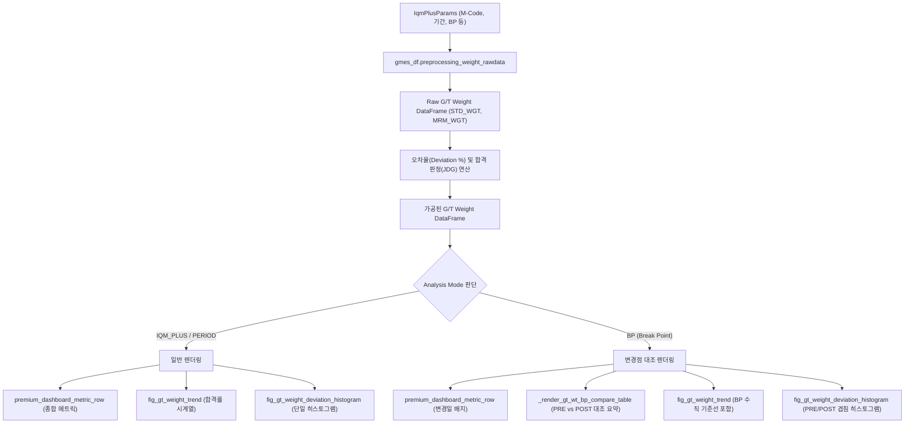

# 2026-07-13 GT/WT Tab Redesign Design Spec

이 문서는 Streamlit 분석 페이지의 **GT/WT(그린중량 및 가류중량) 분석 탭**을 전면 리팩토링하고, 기준 중량(STD_WGT) 대비 측정 중량(MRM_WGT)의 오차율 분석 및 변경점(Break Point) 분석을 고도화하기 위한 설계 사양서(Specification)입니다.

---

## 1. 개요 및 비즈니스 배경

* **배경**: 기존 GT/WT 분석 탭은 단순한 주별/월별 합격률 시계열 추이 차트(`fig_gt_weight_trend`) 하나만을 단조롭게 노출하고 있어 다른 분석 탭(NCF, Uniformity, RR 등)과의 비주얼적 일관성이 부족하고 분석 기능이 제한적이었습니다.
* **목표**: 
  - STD 데이터 대비 **+/- 2.5% 오차 범위**를 기준으로 하는 합격률 지표를 정량적으로 분석하고 시각화합니다.
  - 사용자가 선택한 **Analysis Method(IQM_PLUS, PERIOD, BP)**에 부합하는 동적 화면 구성 및 프리미엄 비주얼 레이아웃을 제공합니다.
  - 변경점(Break Point) 모드 활성화 시 전후(PRE vs POST) 성능 대조 검증 능력을 한층 강화합니다.

---

## 2. 세부 요구사항 (Requirements)

### ① 데이터 수집 및 오차율 연산
* **대상 데이터**: `gmes_df.preprocessing_weight_rawdata`에서 로드되는 완제품 중량 계측 원천 데이터.
* **오차율(Deviation %) 공식**:
  $$\text{Deviation (\%)} = \frac{\text{MRM\_WGT} - \text{STD\_WGT}}{\text{STD\_WGT}} \times 100$$
* **합격 기준(JDG)**: $\text{Deviation (\%)} \in [-2.5\%, +2.5\%]$. 즉, 오차율이 +/- 2.5% 범위 내에 안착하면 합격(1), 벗어나면 불합격(0)으로 판정합니다.

### ② Analysis Method(분석 모드)별 최적화 화면 구성

#### [IQM_PLUS / PERIOD Mode]
* **상단 KPI 메트릭**: 총 검사 수량, 종합 합격률, 평균 오차율, 오차율 표준편차(산포/공정 제어 수준)를 보여주는 통합 프리미엄 메트릭 행 렌더링.
* **차트 레이아웃**: 2:3 가로 분할 그리드 적용.
  - **좌측 (40%)**: 주별/월별 합격률 및 수량 시계열 트렌드 차트 (`fig_gt_weight_trend`)
  - **우측 (60%)**: 개별 중량 오차율 분포 히스토그램 (`fig_gt_weight_deviation_histogram` - 신규 추가)

#### [BP (Break Point) Mode]
* **상단 KPI 메트릭**: 변경 기준일(Break Point) 정보를 포함한 요약 배지 노출.
* **차트 레이아웃 (2단 구성)**:
  - **Row 1 (2:3 가로 분할 그리드)**:
    - **좌측 (40%)**: **PRE vs POST 중량 통계 비교 요약 테이블** (총 수량, 합격률, 평균 오차율, 표준편차)
    - **우측 (60%)**: **Break Point 세로 기준선이 포함된 시계열 트렌드 차트**
  - **Row 2 (100% 가로 너비)**: **PRE vs POST 오차 분포 겹침 히스토그램 (Overlaid Histogram)**
    * 변경점 전후의 중량 편차가 0% 중심으로 수렴하고 변동(Standard Deviation)이 줄어들었는지를 한 차트 안에서 투명도 대비를 통해 입증합니다.

---

## 3. 데이터 흐름 및 아키텍처 (Architecture & Data Flow)

---

## 4. UI/UX 및 컴포넌트 상세 명세

### ① 프리미엄 메트릭 카드 행 (`premium_dashboard_metric_row`)
* M-Code 마스터 정보(공장, 차종, SOP 일자, 양산 경과일)와 함께 다음 3가지 핵심 메트릭을 출력합니다.
  1. **Total Inspected**: 총 검사 타이어 수량
  2. **Overall Pass Rate**: +/- 2.5% 기준 종합 합격률
  3. **Average Deviation**: 평균 오차율 (Deviation %의 산술 평균, 오프셋 수준)
  4. **Standard Deviation (σ)**: 오차율의 표준편차 (공정의 흩어짐/변동 수준)

### ② PRE vs POST 통계 비교 테이블 (`_render_gt_wt_bp_compare_table`)
* BP 모드일 때 PRE(변경 전)와 POST(변경 후) 구간을 비교 대조하는 4열(Metric, Prior, After, Diff) 구조 of 수치 테이블을 구현합니다.
* 출력 메트릭: 총 검사 수량, 합격률, 평균 오차율, 오차율의 표준편차.

### ③ 중량 오차율 분포 히스토그램 (`fig_gt_weight_deviation_histogram`)
* **X축**: Deviation % (구간 단위: 0.1% 또는 0.2% Bin)
* **Y축**: Density 또는 Count (비율/수량)
* **수직 한계선 (Spec Limits)**: `+/- 2.5%` 지점에 오렌지/빨간색 수직 점선(`dash="dash"`) 및 텍스트 어노테이션 추가.
* **BP 모드 대응**: `PRE` 그룹 데이터(투명도가 들어간 연회색 또는 슬레이트색 채우기)와 `POST` 그룹 데이터(투명도가 들어간 오렌지/블루 브랜드 컬러)를 동시에 겹쳐서 표시(plotly `barmode="overlay"`)하여 분포 변화를 직관화합니다.

---

## 5. 설계 준수 및 기술적 제약

* **Safety Lock 준수**: 본 사양서가 사용자 승인을 받기 전까지는 `app/` 소스 코드를 수정하지 않습니다. 승인 완료 후 구현 계획서(`Plan`) 작성을 거쳐 안전하게 구현을 시작합니다.
* **이모지 전면 금지**: Streamlit 마크다운, 라벨, 주석 등에 유니코드 이모지를 기입하지 않으며, 아이콘이 필요한 경우 오직 Google Material 아이콘 구문(`:material/settings:`, `:material/check_circle:` 등)만을 명시하여 바인딩합니다.
* **WSL 경로 제약 준수**: 문서 및 채팅창에 절대 파일 경로(`file:///home/...`)를 노출하지 않으며, 클릭 및 연동 오류 예방을 위해 반드시 평문 상대 경로(예: [app/pages/_20_analysis/data_analysis_page_dev.py](app/pages/_20_analysis/data_analysis_page_dev.py))만을 사용합니다.
* **한국어 주석 및 독스트링 표준**: 소스 코드 내 추가 및 수정되는 모든 함수에는 한국어 주석과 Google/NumPy 스타일의 독스트링을 철저하게 기술하고, 대분류 세션 주석 장식 블록 구조를 준수하여 구현합니다.
