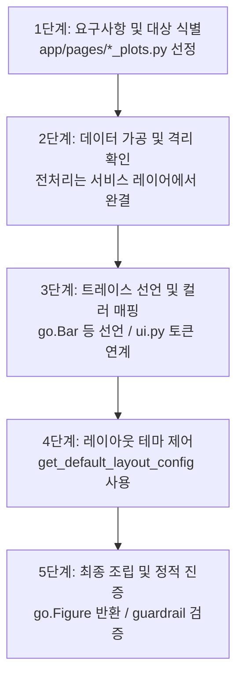

# Plotly 시각화 개발 워크플로우 및 표준 함수 템플릿

본 문서는 사용자의 요청에 따라 대시보드 플롯(차트)을 개발하거나 리팩토링할 때 에이전트와 개발자가 준수해야 하는 실행 워크플로우와 소스코드 레벨의 표준 함수 템플릿을 정의합니다.

---

## 1. Plotly 시각화 개발 워크플로우

새로운 플롯 생성 또는 기존 플롯 수정 요청이 발생하면 다음 5단계의 선형 프로세스를 순차적으로 밟아 진행해야 합니다.



### [1단계] 요구사항 분석 및 개발 대상 선정 (Analyze & Target)
*   사용자 요건에 부합하는 타겟 화면을 선별하고, 메인 화면인 `*_page.py`와 1:1 대칭을 이루는 `*_plots.py` 파일을 탐색하거나 새로 개설합니다.

### [2단계] 데이터 가공 및 경계 격리 확인 (Data Clean Room)
*   시각화 함수 내부에서는 데이터 원본 필터링, 복잡한 통계 수식 계산, 결측치 보정 등 비즈니스 로직을 처리하지 않습니다. 
*   모든 비즈니스 가공은 서비스 레이어(`app/service/`)에서 전담하여 완료된 깨끗한 데이터프레임만 전달받도록 격벽을 수호합니다.

### [3단계] 트레이스 선언 및 시맨틱 컬러 매핑 (Trace Specification & Colors)
*   `go.Bar`, `go.Scatter` 등 표준 Trace 객체를 개별 변수로 선언합니다.
*   하드코딩된 HEX 코드나 `'black'`, `'white'` 같은 인라인 색상명을 전면 배제하고, `app/core/constants/ui.py` 내의 시맨틱 컬러 토큰(예: `colors.chart_series_primary`) 또는 IBM Carbon 공식 14-색 시퀀스를 적용합니다.
*   직관적인 툴팁 렌더링을 위해 마우스 호버 템플릿(`hovertemplate`)은 시각화 함수 내에 HTML과 f-string을 결합하여 직접 작성(Inline Customization)합니다.

### [4단계] 레이아웃 테마 구성 및 제어 (Layout Customization)
*   `app/core/plot/elements/layout.py` 내의 `get_default_layout_config()`를 사용하여 배경, 마진, 공통 폰트 등이 조율된 기본 설정을 인계받습니다.
*   축 폰트 등 정밀 제어가 필요한 영역은 `create_plotly_font_dict("axis_label")` 등 디자인 시스템 유틸을 통해서만 간접 설정합니다.

### [5단계] 선언적 피겨 조립 및 자가 검증 (Assemble & Verify)
*   정의 완료된 `traces`와 `layout_config`를 최종 구조물인 `go.Figure(data=traces, layout=layout_config)`에 주입하여 반환합니다.
*   코드를 제출하기 전, `guardrail/` 검역 도구 및 `verify_code.py`를 기동하여 하드코딩된 컬러나 유니코드 이모지 포함 여부를 정적으로 검증합니다.

---

## 2. 표준 시각화 함수 코드 템플릿

모든 `*_plots.py` 내에 생성되는 차트 드로잉 함수는 아래의 구조적 영역과 흐름을 예외 없이 강제 준수해야 합니다. 아래 템플릿을 복사하여 구현의 기반 뼈대로 활용하십시오.

```python
"""
<도메인/화면명> 시각화 드로잉 모듈
- 작성일: YYYY-MM-DD
- 설명: <시각화 기능에 대한 구체적 설명 기술>
"""

import pandas as pd
import plotly.graph_objects as go
from app.core.constants.ui import colors
from app.core.plot.elements import get_default_layout_config, get_default_trace_config
from app.core.plot import utils

# [경고] Streamlit 라이브러리(st.*)나 비즈니스 서비스 모듈(*_df.py)은 
# 레이어 경계 보존을 위해 절대로 이곳에서 임포트하거나 호출해서는 안 됩니다.

def draw_standard_chart(df: pd.DataFrame, title: str = "표준 차트") -> go.Figure:
    """
    정제된 데이터프레임을 받아 Plotly Figure 객체를 빌드하여 반환합니다.
    
    Args:
        df (pd.DataFrame): 정제가 완결된 입력 데이터프레임
        title (str): 차트 상단 타이틀
        
    Returns:
        go.Figure: 레이아웃 조율이 완료된 Plotly 피겨 객체
    """
    
    # -------------------------------------------------------------------------
    # 1단계. 데이터 검증 및 예외 탈출 (Validate & Early Exit)
    # -------------------------------------------------------------------------
    required_cols = ["X_DIMENSION", "Y_VALUE"]
    if not utils.validate_chart_data(df, required_cols):
        # 데이터가 비어있거나 필수 컬럼이 없으면 빈 차트를 미려하게 그려 즉시 반환
        return utils.create_empty_chart(
            title=title, 
            height=300, 
            message="시각화할 유효한 데이터가 존재하지 않습니다."
        )

    # DataFrame 복사 및 시각화 전용 포맷팅 (예: 천단위 쉼표, 호버 텍스트 가공)
    df_plot = df.copy()
    
    # 가독성과 유지보수 편의성을 수호하기 위해 툴팁 f-string 명세는 함수 내에 직접 하드코딩합니다.
    df_plot["hover_text"] = df_plot.apply(
        lambda r: f"<b>차원</b>: {r['X_DIMENSION']}<br>"
                  f"<b>수량</b>: {r['Y_VALUE']:,} EA", axis=1
    )

    # -------------------------------------------------------------------------
    # 2단계. 트레이스 명세 선언 (Trace Specifications)
    # -------------------------------------------------------------------------
    # 공통 마커 및 라인 스타일 설정을 위해 기본 트레이스 config 취득
    trace_config = get_default_trace_config("bar")
    
    trace = go.Bar(
        x=df_plot["X_DIMENSION"],
        y=df_plot["Y_VALUE"],
        text=df_plot["hover_text"],
        hovertemplate="%{text}<extra></extra>",  # 인라인 호버 가공 연결
        marker=dict(
            # 하드코딩된 HEX 값 대신 디자인 시스템의 시맨틱 컬러 토큰을 사용합니다.
            color=colors.chart_series_primary
        ),
        **trace_config
    )

    # -------------------------------------------------------------------------
    # 3단계. 레이아웃 테마 선언 (Layout Customization)
    # -------------------------------------------------------------------------
    # get_default_layout_config()를 통해 배경색, 여백, 공통 폰트 스타일이 사전 조율된 베이스를 취득합니다.
    layout_config = get_default_layout_config(
        chart_type="bar",
        title=title,
        height=300,
        showlegend=False,
        # 정밀 축 제어가 필요할 때만 선별적으로 중앙 토큰을 전달합니다.
        yaxis_showgrid=True,
        yaxis_gridcolor=colors.slate_200
    )

    # -------------------------------------------------------------------------
    # 4단계. 최종 Figure 선언적 조립 및 반환 (Declarative Injection)
    # -------------------------------------------------------------------------
    fig = go.Figure(data=[trace], layout=layout_config)
    
    return fig
```

---

## 3. 코드 일관성 유지보수 가이드라인

*   **인라인 스타일 하드코딩 금지**: 차트 내부에 `color="black"`, `size=16`, `family="Inter"` 등의 스타일 문자열 및 정수를 개별 수치로 주입하는 행동을 원천 불허합니다. 이는 다크 모드 연동 및 통합 스타일 제어를 방해하는 주범입니다.
*   **유니코드 이모지 배제**: 차트 타이틀, 축 라벨, 범례, 호버 텍스트를 포함한 소스 코드 내 모든 문자열에 유니코드 이모지(예: 📊, 📈)를 삽입하는 것을 전면 금지합니다.
*   **컴포넌트 단일 책임 수호**: 차트를 그리는 파일(`*_plots.py`) 내에 Streamlit UI 레이아웃 위젯(`st.write()`, `st.columns()` 등)을 혼입하지 마십시오. 오직 순수 Figure 객체를 가공하여 리턴하는 일에만 집중해야 합니다.
