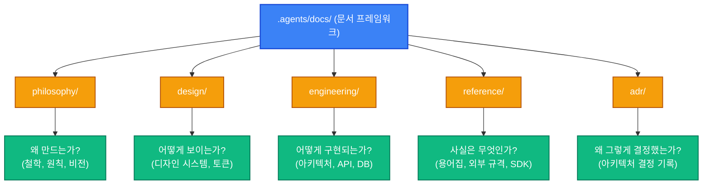

# Agent OS 문서 체계 가이드라인 (README.md)

본 문서는 Agent OS 에이전트 스킬 거버넌스 및 자율 개발을 뒷받침하는 문서화 프레임워크의 구조와 역할 분담을 정의합니다. 에이전트와 엔지니어는 지식의 수집 및 의사결정의 이력을 관리하기 위해 아래 정의된 폴더 체계에 맞추어 문서를 작성하고 동기화해야 합니다.

## 1. 문서화 디렉터리 체계 및 역할

각 폴더는 에이전트와 팀이 당면하는 핵심 질문에 답하며, 정해진 범주의 문서를 보관합니다.

| 폴더 (Folder) | 답하는 핵심 질문 (Core Question) | 담는 문서 범주 (Contained Documents) |
| :--- | :--- | :--- |
| **philosophy** | 왜 만드는가? (Why) | 철학, 개발 원칙, 비전 및 핵심 가치 |
| **design** | 어떻게 보이는가? (Visuals) | 디자인 시스템, 디자인 토큰, UI/UX 컴포넌트 규격 |
| **engineering** | 어떻게 구현되는가? (How) | 아키텍처 가이드, API 명세, DB 스키마, 인프라스트럭처 |
| **reference** | 사실은 무엇인가? (Facts) | 도메인 용어집(Glossary), 외부 연동 규격, SDK 정보 및 기술 레퍼런스 |
| **adr** | 왜 그렇게 결정했는가? (Decisions) | 아키텍처 결정 기록 (Architecture Decision Records) |

---

## 2. 폴더별 상세 가이드

### philosophy
- **목적**: 프로젝트의 근본적인 지향점과 엔지니어링 신념을 정렬합니다.
- **주요 내용**: 개발 방법론적 합의, 에이전트 협업의 최우선 가치, 코드 단순성에 대한 지침 등.

### design
- **목적**: 일관성 있고 수준 높은 비주얼 아이덴티티와 UI/UX 정체성을 규정합니다.
- **주요 내용**: 컬러 토큰 가이드, 그리드 레이아웃 명세, Streamlit 테마 설정, 스타일링 가이드라인.

### engineering
- **목적**: 시스템의 기술적 정밀성과 상호 운용성을 수립합니다.
- **주요 내용**: 3-Layer 아키텍처 경계, 데이터 레이어 연산 규칙, SQL 쿼리 작성 가이드, 성능 최적화 지침.

### reference
- **목적**: 비즈니스 도메인 및 기술 인프라의 객체적인 진실을 기록합니다.
- **주요 내용**: 용어 정의, 타사 API 및 연동 규격 문서, 환경변수 및 시스템 설정 레퍼런스.

### adr (Architecture Decision Records)
- **목적**: 기술적 설계 선택과 이면에 깔린 명확한 트레이드오프 근거를 투명하게 보존합니다.
- **주요 내용**: 특정 라이브러리 채택 사유, 컴포넌트 설계 방향성 변경 기록, 인프라 구조 변경 승인 이력.

---

## 3. 문서 작성 시 핵심 제약 사항 (Crucial Constraints)

1. **이모지 사용 전면 금지 (No Emojis)**:
   - 본 문서 체계 아래 작성되는 모든 마크다운 텍스트, 주석 및 코드 주석에서는 유니코드 이모지(별, 느낌표, 화살표 등)를 사용할 수 없습니다.
2. **WSL 환경 상대 경로 의무화**:
   - 문서 내에 포함되는 모든 파일 및 디렉터리 하이퍼링크는 절대 경로(`file:///...`)를 사용할 수 없으며, 반드시 워크스페이스 루트 기준의 평문 상대 경로만을 사용해야 합니다.
     - 올바른 예: `[.agents/rules/L2-architecture.md](.agents/rules/L2-architecture.md)`
     - 잘못된 예: `[L2-architecture.md](file:///home/jumasi/workstation/.agents/rules/L2-architecture.md)`
3. **지식 그래프 정합성 유지**:
   - 주요 설계 문서가 추가되거나 변경된 경우에는 `graphify update .` 명령을 가동하여 아키텍처 지식 그래프의 최신 상태를 엄격하게 유지하십시오.
