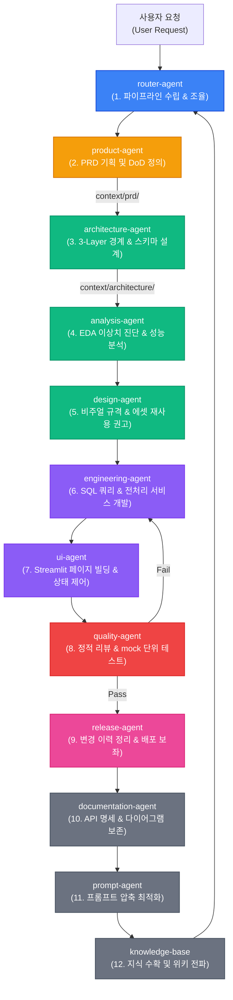

# [Philosophy] Agent OS (.agents/) 종합 아키텍처 가이드

안녕하세요! 이 문서는 본 프로젝트의 핵심이자 AI 협업의 두뇌 역할을 담당하는 **`.agents/` 폴더(서브모듈)의 전체적인 설계 구조와 구동 매커니즘**을 직관적으로 이해하실 수 있도록 기획된 종합 해설서입니다.

---

## 1. `.agents/` 폴더는 왜 존재하는가? (The Core Purpose)

에이전트 협업 시스템(Agent OS)은 복잡한 소프트웨어 엔지니어링 문제를 해결하기 위해, 하나의 범용 LLM에게 모든 작업을 맡기는 대신 **특정 도메인과 책임(Responsibility)에 집중하는 전문 에이전트들의 오케스트레이션 네트워크**를 가동합니다.

이때 `.agents/` 폴더는 다음과 같은 역할을 전담하는 **지능 및 통제 시스템의 SSOT(단일 진실 공급원)**입니다:
1.  **에이전트 정체성(Persona)**: 각 에이전트가 어떤 이름, 모델, 도구, 제약사항을 가지는지 규정합니다.
2.  **행동 가드레일(Rules)**: 코딩 컨벤션, 아키텍처 규칙, UI 규격 등 시스템 불변의 상시 가이드라인을 제어합니다.
3.  **오케스트레이션 파이프라인(Router)**: 사용자의 자연어 명령을 분류하고 어떤 순서로 에이전트들을 조율(체이닝)할지 기획합니다.

---

## 2. `.agents/` 폴더의 물리적 디렉터리 레이아웃 (Folder Structure)

`.agents/` 하위 폴더들은 각자의 고유한 역할에 따라 엄격하게 격리되어 보존됩니다.

```plaintext
.agents/
├── docs/                        # [문서 가이드라인 레이어] 에이전트 문서 표준화 프레임워크
│   ├── philosophy/             # [철학 레이어] 시스템 비전, 아키텍처 로드맵, 기본 신조 보존
│   │   ├── vision.md               # 에이전트 OS가 추구하는 방향성
│   │   ├── principles.md           # 개발 협업 5대 기본 원칙
│   │   └── agent_os_architecture.md # (본 문서) 아키텍처 총괄 해설서
│   │
│   ├── router/                 # [조율 레이어 문서] 자연어 분류 알고리즘 및 표준 파이프라인 가이드
│   │   ├── router_architecture.md   # 라우팅 오케스트레이션 아키텍처 설계서
│   │   ├── work_classification.md   # 작업 분류 체계 정의서
│   │   ├── intent_analysis.md       # 사용자 의도 분석 가이드
│   │   └── routing_table.md         # 시나리오별 라우팅 테이블 구조 및 실행 규칙
│   │
│   └── README.md               # 문서 디렉터리 체계 및 역할 정의서
│
├── rules/                      # [제약 레이어] 에이전트가 코딩 시 상시 준수해야 하는 강제 가드레일
│   ├── L2-architecture.md      # 3-Layer(Presentation-Service-Query) 레이어 경계 준수 규칙
│   ├── L2-naming-convention.md # 변수, 테이블, 모듈 명명 규칙
│   └── L2-color-system.md      # Streamlit 내 이모지 절대 금지 및 컬러 가이드라인
│
├── agents/                     # [지능 레이어] 12대 정예 에이전트의 명세 및 메타데이터 정의
│   ├── agents_registry.json    # 12대 에이전트 설정 및 도구 바인딩 마스터 레지스트리 (JSON)
│   ├── 01_agent_governance_constitution.md               # 중앙 거버넌스 위계 및 에이전트 행동 규칙 SSOT 문서
│   │
│   ├── {agent-id}/             # 각 에이전트별 독립 샌드박스 설정 폴더
│   │   ├── agent.json          # gRPC/Connect Go 백엔드가 로딩하는 개별 에이전트 설정서 (Input, Tool 등)
│   │   └── routing_table_rules.json # 6대 작업 시나리오 표준 실행 흐름 정의서
│   │
│   └── roles/                  # 사람이 읽고 관리하기 위한 에이전트 상세 명세서 서브폴더
│       ├── router-agent.md     # 각 에이전트의 구체적 허용/금지(Allowed/Forbidden) 작업 명세
│       └── product-agent.md
│
└── context/                    # [데이터 버스 레이어] 에이전트 간의 결과물(PRD, 설계서)을 전달하는 우편함
    ├── prd/                    # Product Agent가 출력한 PRD 마크다운 저장소
    └── architecture/           # Architecture Agent가 출력한 설계서 저장소
```

---

## 3. 핵심 설계 사상: 22대 체제에서 12대 정예 체제로의 통합 이유

과거에는 에이전트가 세분화되어 22대 체제로 구동되었습니다. 하지만 실제 구동 시 다음과 같은 문제점들이 발생했습니다:
1.  **책임의 모호함(Overlap)**: Planner와 Requirements, Reviewer와 Evaluator가 서로의 경계를 침범하고 충돌하는 현상이 빈번했습니다.
2.  **컨텍스트 오버헤드(Overhead)**: 에이전트 수가 너무 많아 실행 단계마다 쓸데없이 많은 토큰(비용)이 들고 실행 속도가 현저히 느려졌습니다.

이에 따라 책임을 가장 명확하고 유기적으로 엮을 수 있는 **12대 고성능 에이전트 체제**로 전격 개편되었습니다:

*   **기획/DoD의 일원화**: Planner + Requirements ➔ **Product Agent**
*   **구조/테이블 설계 일원화**: Architecture + Data Modeling ➔ **Architecture Agent**
*   **수치/성능 정량 정밀 진단 일원화**: Project Health + Performance + Domain Insight ➔ **Analysis Agent**
*   **디자인 및 컴포넌트 일치성 일원화**: Design System + Librarian + Component ➔ **Design Agent**
*   **백엔드 로직 및 자동화 통합**: Automation + Refactoring ➔ **Engineering Agent**
*   **검증/테스트 게이트 일원화**: Reviewer + Evaluator + Test ➔ **Quality Agent**

---

## 4. 에이전트 협업 라이프사이클 흐름 (Standard Pipeline Sequence)

사용자로부터 새로운 기능 개발 요청이 들어오면 에이전트들은 정해진 아키텍처 규칙에 따라 **물리적/논리적 파이프라인 시퀀스**를 그리며 앞 단계의 산출물을 가공하여 전달합니다.



---

## 5. 핵심 가치 및 마인드셋 (Mindset)

*   **가장 중요한 가치는 단순함(Simplicity)입니다**: 무리하게 기능을 늘리지 않고, 각 레이어(Presentation-Service-Query)의 경계를 준수하여 스파게티 코드가 생기지 않도록 방어해야 합니다.
*   **품질 게이트(Quality-agent)는 통과의 척도입니다**: 모든 구현 사항은 반드시 단위/통합 테스트 코드를 동반하며, 품질 게이트를 넘지 못한 코드는 배포(Merge)되어서는 안 됩니다.
*   **이모지는 규칙 파괴자입니다**: Streamlit TUI 환경 내 이모지 오작동을 차단하기 위해 주석을 포함한 어떠한 장소에서도 이모지를 사용하지 않습니다.

이 가이드를 통해 `.agents/` 폴더가 어떤 일관성 속에서 움직이는지 명확히 정비하셨기를 바랍니다! 궁금한 사항이 있으시면 언제든지 에이전트들에게 질의해 주세요!
