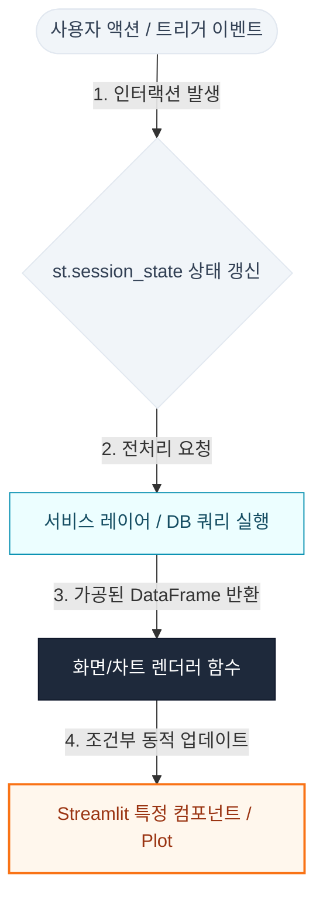

# PRD: [화면/대시보드 국문 명칭] ([화면 영문 명칭])

> **[필독 개발 지침]**
> 본 화면은 [.agents/wiki/dashboard_development_standard.md](.agents/wiki/dashboard_development_standard.md)을 기본 적용하며, 본 문서에는 공통 표준과 다른 특별 사항(Delta)만 명시한다.

---

## 0. Source Mapping

- **Page**: `app/pages/[대분류_폴더명]/[화면_컨트롤러_파일명.py]` ([예: app/pages/quality/page_quality_issue.py])
- **Service**: `app/service/[전처리_서비스_파일명.py]` ([예: app/service/quality_issue_service.py])
- **Tests**: `tests/[단위_테스트_파일명.py]` ([예: tests/test_quality_issue_service.py])
- **DB**: `[로컬_데이터베이스_경로 / 원천_실적_물리_테이블명]` ([예: SQLite local.data/database/staging.db / Databricks 테이블명])

---

## 1. 목표와 범위 (Goal & Scope)

*   **문제 (Problem Statement)**: [해결하고자 하는 비즈니스 상의 고충 기술 (예: 기존 수동 집계 방식으로 인한 리드타임 지연 및 오차 발생)]
*   **목표 (Product Goal)**: [화면 구축을 통해 달성하고자 하는 궁극적 목표 기술 (예: 실시간 데이터베이스 연동을 통해 품질 리드타임을 모니터링할 수 있는 대시보드 구축)]
*   **In Scope**:
    *   [포함 1] [인앱 핵심 기능 범위 기술 (예: SQLite staging.db 기반 특정 규격 마스터 목록 조회 및 필터링)]
    *   [포함 2] [데이터 시각화 범위 기술 (예: 실시간 원천 데이터를 통한 집계 및 Pareto 분석 차트 표출)]
*   **Out of Scope**:
    *   [제외 1] [이번 스프린트에서 배제할 분석 모델/범위 기술 (예: 예측 알고리즘 분석 및 다중 공장 간 교차 비교 기능 제외)]
    *   [제외 2] [개발하지 않는 타깃 플랫폼 기술 (예: 모바일 네이티브 레이아웃 대응은 배제하고 데스크톱 반응형 웹만 지원)]

---

## 2. 기능 요구사항 (Functional Requirements)

| ID | 요구사항 | 우선순위 | 인수 조건 (Acceptance Criteria) |
| :--- | :--- | :--- | :--- |
| `REQ-01` | [요구사항 명칭 및 핵심 기능 설명 기술 (예: 특정 자재코드 조회 및 그리드 렌더링)] | Must | [동작 성공을 확인하기 위한 인수 조건 기술 (예: 자재코드가 그리드 상에 누락 없이 출력되어야 함)] |
| `REQ-02` | [요구사항 명칭 및 핵심 기능 설명 기술 (예: 불량 점유 비율 Pareto 차트 동적 렌더링)] | Should | [동작 성공을 확인하기 위한 인수 조건 기술 (예: 특정 Row 클릭 시 해당 데이터에 조인되는 Pareto가 동적으로 변경되어야 함)] |
| `REQ-03` | [요구사항 명칭 및 핵심 기능 설명 기술 (예: 상세 이력 CSV 파일 다운로드 기능)] | Could | [동작 성공을 확인하기 위한 인수 조건 기술 (예: 전체 DataFrame을 로컬 CSV로 저장할 수 있는 버튼 제공)] |

*우선순위 구분: Must (필수 요구사항 - 미반영 시 릴리즈 불가) / Should (중요 요구사항) / Could (리소스 여유 시 반영)*

---

## 3. 데이터와 계산 (Data & Calculations)

*   **원천 테이블 (Source Tables)**:
    *   [Staging/로컬 DB명 ➡️ 물리 테이블명 (예: SQLite staging.db ➡️ iqm_plus_spec_master)]
    *   [원천 Cloud DW명 ➡️ 물리 테이블명 (예: Databricks ➡️ hkt_dw.production.wrk_f_lwrkts118)]
*   **사용 칼럼 (Key Fields)**:
    *   `[물리_칼럼명_1]` ([데이터타입]): [사용 목적 기술 (예: M_CODE (VARCHAR): 자재코드 조인 식별 Key)]
    *   `[물리_칼럼명_2]` ([데이터타입]): [사용 목적 기술 (예: DFT_QTY (INT): 부적합 수량)]
    *   `[물리_칼럼명_3]` ([데이터타입]): [사용 목적 기술 (예: PRDT_QTY (INT): 생산 실적 수량)]
*   **조인/필터 규칙 (Joins & Filters)**:
    *   조인: [테이블 간의 릴레이션 및 조인 기준 기술 (예: 로컬 마스터와 원천 실적 테이블을 M_CODE 기준으로 LEFT JOIN 처리)]
    *   필터: [조회 데이터를 필터링하기 위한 조건문 기술 (예: PLANT = 'TP' 및 대상 연도가 2026년 이상인 자재 데이터만 조회 대상으로 한정)]
*   **계산 공식 (Formulas)**:
    *   **[핵심 산출 지표명 (예: Scrap PPM)]**: `[수학적/논리적 수식 서술 (예: (부적합 수량 / 총 생산량) * 1,000,000)]`
    *   **Zero-Division Guard**: [ZeroDivisionError 방지를 위한 예외 조항 명세 (예: 분모가 0 또는 Null인 경우 결과값을 0.0으로 자동 처리함)]

---

## 4. 화면 구성 (Screen Layout)

*   **필터 (Filters)**: [사이드바 및 화면 필터 위젯 명세 (예: 사이드바 연도 선택 셀렉트박스 st.selectbox)]
*   **KPI (Key Metrics)**: [상단 핵심 성과 요약 메트릭 카드 명세 (예: 총 생산량, 부적합 수량, PPM 표기 가로 카드)]
*   **차트 (Charts)**: [중앙 분석 시각화 차트 명세 (예: 좌측 점유율 파이 차트, 우측 시계열 바-라인 혼합 차트)]
*   **상세 테이블 (Details)**: [하단 세부 내역 그리드 명세 (예: 상세 RAWDATA 테이블 렌더링 st.dataframe)]

### 사용자 상호작용 특이사항 (Interactive Deltas) - [선택 사항]
*   기본 사용자 흐름(화면 진입 ➡️ 필터 조작 ➡️ 리렌더링)은 **[공통 개발 표준](../../wiki/dashboard_development_standard.md)**을 자동으로 따르므로 별도로 서술하지 않습니다.
*   **화면별 특수 동적 인터랙션**(예: 특정 Row 클릭 시 하위 컴포넌트 실시간 재조회, 복잡한 탭 간 상태 보존 등)이 존재하는 경우에만, 텍스트 형태의 서술 또는 **필요 시 아래의 표준 흐름도(Mermaid) 구조를 활용하여 선택적으로** 명세합니다.
    *   [예: 그리드 Row 선택 시에만 상세 파레토 차트를 실시간 재조회하여 표출한다.]
    *   [예: 탭 전환 시 기존 조회 필터 세션 값은 유지한 상태로 화면을 그린다.]

---

## 5. 검증 (Verification)

*   **주요 예외 (Exceptions)**:
    *   [예외 조건 및 대상 원천 DB 명세] 조회 실패 시 실적 영역을 오류 상태(예: 에러 배너 노출)로 명확히 표시하고, 데이터가 비어 있는 '데이터 없음' 케이스와 실제 통신이 두절된 '오류 상태(실패)'를 명확히 구분하여 가이드라인을 명시합니다.
    *   마지막 정상 조회 데이터(Cache)가 존재하는 경우 마지막 정상 조회 시각(Timestamp)을 화면에 표시하고, 그 외에는 명확한 가이드 메시지를 인앱에 표출합니다.
*   **테스트 케이스 (Test Cases)**:
    *   `[TC-01]` [검증 대상 (예: 연도 선택 변경 시 전처리 서비스의 DataFrame이 연동되어 갱신되는가)]
    *   `[TC-02]` [검증 대상 (예: 원천 데이터가 0건인 극단적 케이스에 대해 ZeroDivision 런타임 에러 없이 빈 화면 가이드가 안전하게 출력되는가)]
*   **완료 조건 (Definition of Done)**:
    *   [DoD 1] 정적 무결성 분석(`verify_code.py`) 구문 오류 없이 통과 완료.
    *   [DoD 2] 디자인 토큰 및 배색 표준 검증 통과.

*이하 항목은 화면별 특수한 기능 요구사항이 포함된 경우에만 부분적으로 선택하여 기재합니다.*

*   **권한 (Authorization)**: [특정 계정/역할 보안 규칙 기술 (예: 품질 승인 책임자 이상의 등급만 화면 조회 가드 적용)]
*   **성능 (Performance)**: [대용량 데이터 조회 시의 최적화 규칙 기술 (예: 렌더링 최적화 및 쿼리 병목 튜닝 조항 기술)]
*   **데이터 갱신 (Data Refresh)**: [데이터 갱신 주기 제어 규칙 기술 (예: 수시 동기화가 필요한 경우 수동 갱신 리프레시 버튼 연동)]
*   **특수 UX (Special UX)**: [컴포넌트 단위의 특수 반응형 기법 기술 (예: Plot 내부의 특정 데이터 포인트 더블클릭 시 상세 팝업 오픈)]
*   **지식 문서 연결 (Knowledge Links)**:
    *   의사결정 원천 이력: `[.agents/raw/decision/[의사결정_이력_파일명.md]](.agents/raw/decision/[의사결정_이력_파일명.md])`
    *   위키 통합 지식 색인: `[.agents/indexes/Wiki Index.md](.agents/indexes/Wiki%20Index.md)`
