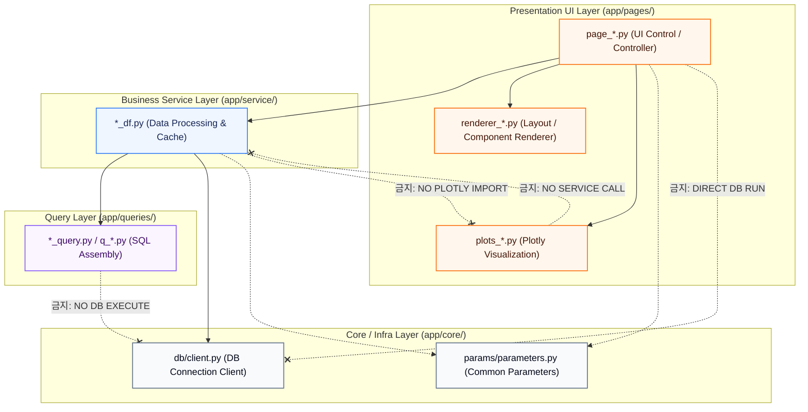

# L2-architecture.md (L2 3-레이어 아키텍처 및 격벽 수칙)

본 문서는 프로젝트의 지속 가능한 확장성을 수호하기 위해 3-레이어 아키텍처(3-Layer Architecture) 물리 격벽 및 의존성 제약 조건을 정의한 **단일 진실 공급원(SSOT) 규칙**입니다. AGENTS.md의 초핵심 6대 헌법을 상시 선제 준수하십시오.

---

## 1. 3-레이어 아키텍처 레이아웃 및 책임 (Standard Layout)

모든 소스 코드는 UI(Presentation), 비즈니스 서비스, 데이터베이스 쿼리를 완전히 물리적으로 격리하는 3-레이어를 엄격히 준수합니다.

```
workstation/
└── app/
    ├── core/                # [공통/인프라] 공통 UI 헬퍼, 파라미터, DB 클라이언트
    ├── pages/               # [UI 레이어] Streamlit 화면 배치 및 Plotly 시각화 드로잉
    ├── service/             # [서비스 레이어] Pandas 데이터 전처리, 통계 집계, 메모리 캐싱
    └── queries/             # [쿼리 레이어] Pure SQL 쿼리 텍스트 조립
```

### ① UI 레이어 (`app/pages/`)
* **책임**: 사용자의 필터 입력을 제어하고, 화면 레이아웃 구성 및 최종 차트와 지표 카드를 렌더링합니다.
* **물리 격리**: 모든 화면은 카테고리(`app/pages/category/`) 하위의 페이지별 전용 폴더(`page_folder/`)로 그룹화되어 관리됩니다.
  * **폴더 구조**: `app/pages/category/page_folder/` (예: `app/pages/_10_dashboard/oe_quality_dashboard/`)
    - **제약**: `page_folder` 이하의 추가 하위 폴더 생성을 엄격히 금지합니다. 파일 분리가 필요하다면 sub 메뉴나 탭 제목을 활용하여 동일 폴더 내에서 `*_tab.py` 형태로 분리하십시오.
  * **파일명 규칙**:
    - **화면 컨트롤러**: `page_*.py` (예: `page_oe_quality_dashboard.py`)
    - **시각화 드로잉**: `plots_*.py` (예: `plots_oe_quality_dashboard.py`)
    - **PRD 요구사항 문서**: `prd_*.md` (예: `prd_oe_quality_dashboard.md`)
    - **페이지 관련 문서**: `page_*.md` (예: `page_oe_quality_dashboard.md`)
    - **UI 렌더링 분리**: `renderer_*.py` (예: `renderer_oe_quality_dashboard.py`)
  * **렌더러 분리 기준**: 단일 화면 컨트롤러(`page_*.py`) 파일이 **1,000줄을 초과**하거나 복잡한 레이아웃 구조를 갖는 경우, 화면 배치 및 컴포넌트 렌더링 코드를 `renderer_*.py`로 과감히 분리하여 관심사를 격리하고 가독성을 확보해야 합니다.
  * [금지] 화면 컨트롤러 내부에 수백 줄의 Plotly 차트 드로잉 코드를 인라인 기술하는 행위 (`plots_*.py` 활용).
  * [금지] `plots_*.py` 내부에서 Streamlit 레이아웃 요소(`st.write`, `st.columns` 등)를 호출하는 행위.

### ② 서비스 레이어 (`app/service/`)
* **책임**: DB 클라이언트를 통해 수집된 원시 데이터(Raw DataFrame)를 결측값 대체, 데이터 타입 복구, 비즈니스 수식 적용, 통계 집계 연산 등을 거쳐 정제된 Pandas DataFrame으로 가공합니다.
* **물리 격리**: 모든 비즈니스 로직 함수는 이 레이어 내의 `*_df.py` 파일에만 존재해야 합니다.
  * [금지] UI 및 쿼리 레이어 내부에 비즈니스 통계 수식이나 전처리 루틴을 혼용하는 행위.

### ③ 쿼리 레이어 (`app/queries/`)
* **책임**: 데이터베이스에 전송할 SQL 쿼리 문자열을 조립 및 생성하여 반환합니다.
* **물리 격리**: 모든 SQL 조립 모듈은 `*_query.py` 또는 `q_*.py` 파일 형식을 지키며 이 레이어 아래에 위치합니다.
  * [금지] 쿼리 파일 내에서 직접 데이터베이스 커넥터를 임포트하여 쿼리를 실행(`execute`)하는 행위. 오직 순수 문자열(`str`)인 SQL을 반환하는 함수만 포함되어야 합니다.

---

## 2. 레이어간 격벽 제약 조건 (Strict Layer Isolation Rules)

안정적인 3-레이어 아키텍처 유지를 위해 아래의 **참조 및 의존성 격벽 제약 조건**을 적용합니다.



* **역방향 의존성 전면 차단**: 의존성 방향은 무조건 `[UI -> Service -> Query]`로 순방향으로만 흐릅니다. `queries/`는 `service/`나 `pages/`를 임포트할 수 없으며, `service/`는 `pages/`에 속한 모듈 및 Plotly 시각화 파일(`*_plots.py`)을 임포트할 수 없습니다.
* **UI 레이어의 DB 직접 실행 금지**: UI 컨트롤러나 차트 드로잉 모듈 내부에서 직접 DB 클라이언트를 import하여 쿼리를 수행하는 행위를 완전히 금지합니다.
* **서비스 레이어의 UI 종속성 배제**: 서비스 레이어 내부에서 `plotly`, `streamlit` 등의 패키지를 import하여 차트 컴포넌트 객체를 생성 또는 반환하는 행위는 불허하며, 오직 데이터 타입(Pandas DataFrame, dict 등)만을 반환해야 합니다.

---

## 3. 아키텍처 정합성 수호 4대 체크리스트 (Architectural Checklist)

개발 완료 및 릴리즈 전, 에이전트는 본 규칙과 일치하는지 아래 4대 조항을 기준으로 자율 검증을 완수해야 합니다.

1. **공개 인터페이스 영속성 보장**: `core/params/parameters.py`에 정의된 필터 파라미터 `dataclass` 명세 및 공용 서비스 API 함수의 호출 명세(Signature), 그리고 최종 반환되는 DataFrame의 핵심 컬럼명을 변경하지 않았는가?
2. **성능 캐싱 보존**: 연산 및 쿼리를 호출하는 서비스 레이어 함수에 적절한 `@st.cache_data` 데코레이터와 만료 시간(ttl)이 적용되어 있는가?
3. **비즈니스 vs 시각화 전처리 경계 분리**: 조건 필터링, 비즈니스 계산 공식 등은 서비스 레이어(`*_df.py`)에서 완수하고, 호버 텍스트 가공 이나 축 포맷팅(Tickformat) 등 비주얼 종속 가공만 플롯 레이어(`*_plots.py`)에서 수행하도록 경계를 엄수했는가?
4. **무단 접근 금지 구역 보호**: 사용자 보안/로그인 제어 구역(`login_page.py`), DB 물리 커넥터 구역(`client.py`), SQLite 마이그레이션 구역의 소스 코드를 건드리지 않았는가?
