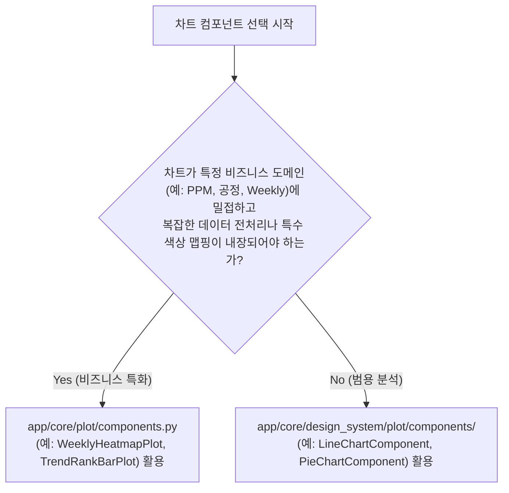

# L3-plot.md (L3 시각화/차트 개발 규칙)

본 문서는 일관되고 가독성 높은 차트 시각화 품질을 보장하기 위해 Plotly 차트 드로잉 및 테마 옵션을 수립하는 **단일 진실 공급원(SSOT) 규칙**입니다.

---

## 1. 플롯 레이어의 핵심 역할 및 위치
* **위치**: `app/pages/` 하위 각 페이지 폴더에 메인 화면 컨트롤러 파일과 동거
* **파일명**: `*_plots.py` 명명 규칙 준수 (예: `cqms_dashboard_plots.py`)
* **책임**: 정제된 Pandas DataFrame을 인풋으로 받아, 마우스 호버 및 포맷팅 등 비주얼 세부 옵션을 튜닝한 **Plotly Figure 객체**를 빌드하여 반환합니다.

---

## 2. 금지 및 제약 수칙 (Guardrails)

1. **Streamlit UI 요소 호출 금지**: `*_plots.py` 내부에서는 `st.write`, `st.columns` 등 화면 레이아웃 및 Streamlit 렌더링 요소를 임포트하거나 호출할 수 없습니다. 오직 순수 Plotly Figure 객체만 조립 및 리턴합니다.
2. **비즈니스 가공 금지**: 플롯 내부에서 원본 조건 필터링, 복잡한 비즈니스 통계 수식 연산, 결측치 대체 등을 직접 수행해서는 안 되며, 서비스 레이어(`app/service/*_df.py`)에 책임을 넘깁니다.
3. **spikemode 하드코딩 금지**: `xaxis` 또는 `yaxis`의 `spikemode` 속성에 `'vertical'`, `'horizontal'` 등 Plotly 비표준 스키마 값을 임의 대입하지 마십시오. 가급적 기본값을 생용해 생략하는 것을 권장합니다.

---

## 3. 시각화 개발 3대 표준

1. **시각화 전처리 한계 준수**: 호버 텍스트 문자열 포맷 조립, 차트 형태 정렬을 위한 가공(Top-N 자르기 및 Others 그룹화), 축 틱 포맷(`tickformat`) 등 오직 **비주얼 프레젠테이션 종속적인 포맷팅 가공**만 플롯 레이어 내에서 한정 처리합니다.
2. **시맨틱 차트 토큰 준수**: 색상 마커 지정 시 임의의 Hex 코드를 하드코딩하지 않고, 반드시 최상위 표준인 [L2-color-system.md](L2-color-system.md)를 참조하여 `chart_series_primary`, `spec_limit`, `target_line` 등의 차트 의미(Semantic) 토큰을 매핑해야 합니다.
3. **타이포그래피 및 투명 배경 통합**: 차트 반환 직전, 일관된 디스플레이 폰트 스펙과 텍스트 크기가 이식된 공통 헬퍼인 `apply_custom_chart_style(fig)`를 무조건 호출해야 합니다. 또한 st.container 카드 패널과의 조화를 위해 `paper_bgcolor` 및 `plot_bgcolor`는 항상 투명(`rgba(0,0,0,0)`)화합니다.

## 4. 공통 컴포넌트(design_system.plot) vs 도메인 플롯(core.plot) 선택 및 라우팅 표준 (AI 오선택 방지)

에이전트가 새로운 대시보드 화면에 차트를 생성하거나 기존 코드를 리팩토링할 때, 컴포넌트 보관 및 패키지 위치가 이원화되어 있으므로 다음 의사결정 트리를 반드시 엄격히 따릅니다.

### ① `app/core/design_system/plot/components/` (범용 추상 표준화)
- **대상**: `LineChartComponent`, `BarChartComponent`, `PieChartComponent`, `GaugeChartComponent`, `IndicatorBulletComponent`
- **사용 시점**: 축 맵핑, 단순 지표 시계열 추이, 원형 세그먼트 비율 분석 등 **순수 원초적 차트 구성 자산**으로 충분할 때 선택합니다.
- **특징**: `BaseChartComponent` 상속체이며, 명명 규칙 끝에 `*Component` 서픽스를 가집니다.

### ② `app/core/plot/components.py` (비즈니스 가공 통합)
- **대상**: `WeeklyHeatmapPlot`, `TrendRankBarPlot`, `PremiumDonutPlot`
- **사용 시점**: PPM, OEM, 차량 모델 등 **특화된 품질 관리 실적 스키마**에 단단히 종속적이거나 복합적인 시각 전처리를 전담해야 할 때 선택합니다.
- **특징**: 명명 규칙 끝에 `*Plot` 서픽스를 가집니다.

---

## 5. 시각화 레이어 정합성 체크리스트 (에이전트 자가 검증용)

1. 플롯 모듈이 `streamlit` UI 라이브러리를 직접 호출하거나 임포트하지 않는가?
2. 마커 색상에 임의의 원시 HEX 값이 하드코딩되지 않고 디자인 시스템 시맨틱 토큰이 지정되었는가?
3. Plotly Figure를 빌드한 후, 최종 반환하기 직전에 `apply_custom_chart_style(fig)` 헬퍼를 경유하였는가?
4. 차트 외곽 및 내부 배경색이 투명(`rgba(0,0,0,0)`)으로 강제 지정되어 플랫 카드 디자인과 조화를 이루는가?
5. **컴포넌트 라우팅**: AI가 차트 종류를 선택할 때 범용 규격은 `*Component`를, 도메인 규격은 `*Plot`을 철저히 변별하여 알맞게 선택하였는가?
