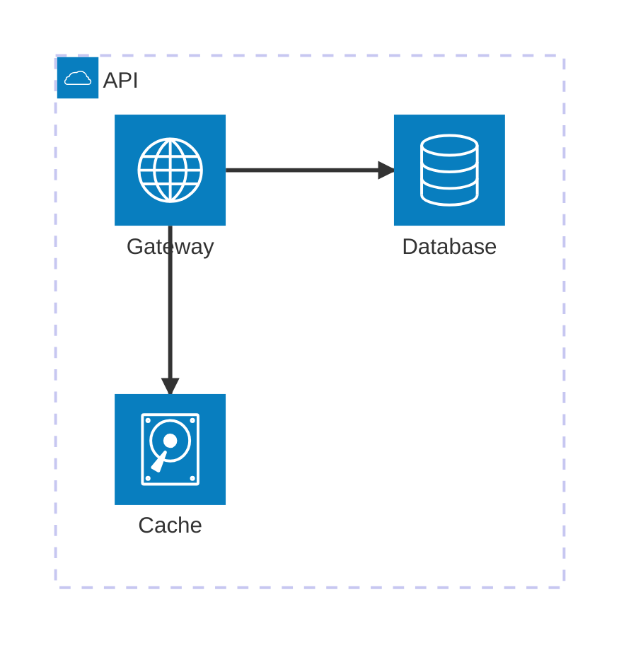
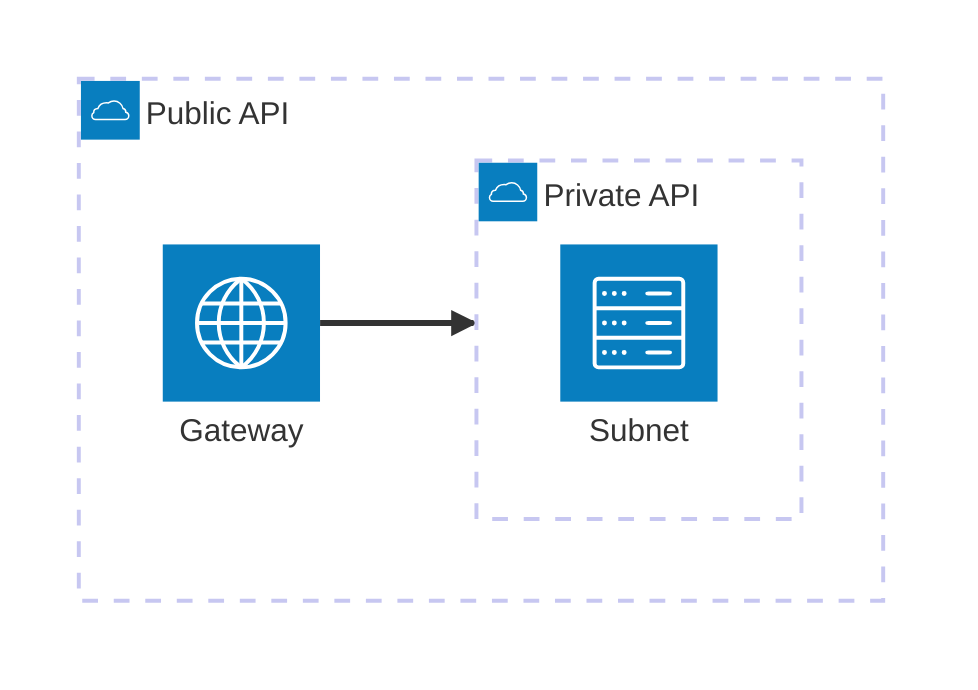

# Architecture Diagram Syntax

Architecture diagrams use `architecture-beta` and are well suited for cloud and CI/CD service layouts.

## Basic Structure



## Building Blocks

### Groups

```text
group {group id}({icon name})[{title}] (in {parent id})?
```

### Services

```text
service {service id}({icon name})[{title}] (in {parent id})?
```

### Junctions

```text
junction {junction id} (in {parent id})?
```

## Edges

The edge syntax is:

```text
{serviceId}{{group}}?:{T|B|L|R} {<}?--{>}? {T|B|L|R}:{serviceId}{{group}}?
```

- Use `L`, `R`, `T`, or `B` to choose the side of each service.
- Add `<` and/or `>` to point the arrow head in the desired direction.
- Use the optional `{group}` modifier when connecting a service through its containing group.

### Example



## Icons

Default icons include `cloud`, `database`, `disk`, `internet`, and `server`.

You can also use icon packs or custom icons by following Mermaid's icon registration configuration.

### Example: AWS Icons

```mermaid
architecture-beta
    group api(logos:aws-lambda)[API]

    service db(logos:aws-aurora)[Database] in api
    service disk1(logos:aws-glacier)[Storage] in api
    service disk2(logos:aws-s3)[Storage] in api
    service server(logos:aws-ec2)[Server] in api

    db:L -- R:server
    disk1:T -- B:server
    disk2:T -- B:db
```


logos reference: https://icon-sets.iconify.design/logos
