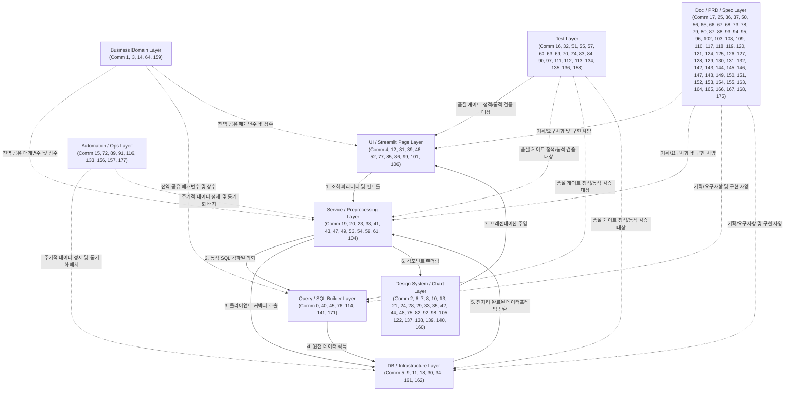

# Community Catalog

## Executive Summary

본 문서는 graphify 지식 그래프 정적 분석 결과를 바탕으로, 기계적인 번호로 나열되어 있던 219개의 커뮤니티 구조를 사람이 직관적으로 이해할 수 있는 **아키텍처 카탈로그**로 해독 및 구조화한 최종 해설서입니다.

### 1. 코드베이스의 대형 물리 구조 및 경향성
* **전체 규모**: 289개 파일, 약 29.6만 단어 수준의 중대형 프로젝트이며, 3,146개의 노드와 5,710개의 엣지를 지닌 지식 그래프입니다.
* **코어 의존성 축**: 인프라 DB 접근 지점을 완전히 통제하는 `get_client()`와 시각화 브릿지 역할을 담당하는 `get_font_family()`, 전역 데이터 모델인 각종 `*Params` 구조체들이 고도의 Betweenness Centrality를 형성하며 전체 레이어 간 상호 연결의 실질적인 뼈대를 이루고 있습니다.
* **레이어 위반 및 기술 부채**: 3계층 아키텍처(Presentation - Service - Query) 헌법이 수립되어 있으나, 일부 레거시 화면(`iqm_analysis_page.py`, `assess_log_temp_page.py` 등)에서 서비스 레이어를 바이패스하고 쿼리를 직접 수입하거나, 개별 플롯 드로잉 모듈에 스타일링 함수(`apply_custom_chart_style`)가 개별 중복 복제되어 있는 점 등 리팩터링이 시급한 지점들이 다수 검출되었습니다.

### 2. 가장 중요한 7대 핵심 커뮤니티
1. **Community 9 [DB 연결 팩토리 및 핵심 영속 바인딩]**: `get_client()` 중심의 다중 DB 커넥터 및 매개변수 주입 레이어.
2. **Community 4 [IQM Plus 대시보드 화면 컨트롤러]**: 제품 완성도 지수를 통제하고 화면을 구성하는 핵심 프레젠테이션 영역.
3. **Community 5 [중앙 에러 제어 및 영속성 이력 기록]**: `SQLiteDML` 기반의 장애 분리 및 안전한 격리 로깅 인프라.
4. **Community 2 [공통 Plotly 차트 컴포넌트 프레임워크]**: 표준 디자인 시스템 테마가 하향식으로 상속되는 완성형 시각화 컴포넌트군.
5. **Community 23 [동적 누적 품질지수 연산 서비스]**: 전월 실적 합산 등 IQM Plus 지표를 완성하는 비즈니스 로직의 심장부.
6. **Community 0 [동적 SQL 조건식/필터 결합 유틸]**: 순수 SQL 가공 및 동적 WHERE 절 빌더 유틸리티 영역.
7. **Community 15 [자동화 로거 및 수동 배치 집계 허브]**: Cron/Manual 배치의 생명 주기를 보증하고 Staging DB 적재를 관리하는 핵심 배치 통제소.

### 3. 신규 개발자를 위한 추천 탐독 로드맵
신규 개발자는 시스템의 뼈대와 흐름을 안전하게 이해하기 위해 아래의 **하향식(Top-Down) 동선**에 따라 커뮤니티와 물리 소스 코드를 읽어야 합니다.
1. **[1단계] 도메인 모델 파악**: **Community 14 (날짜/지표 매개변수)** 및 **Community 1**을 먼저 독습하여 비즈니스 데이터가 정의되는 매개변수 구조체의 속성을 파악합니다.
2. **[2단계] 원천 쿼리 분석**: **Community 45** 및 **Community 114**를 통해 DWH 테이블에서 실시간 생산 실적 및 불량을 긁어오는 SQL을 분석합니다.
3. **[3단계] 지표 정제 연산 학습**: **Community 23 (동적 누적 연산)** 및 **Community 43 (누적 캐시 자가 치유)**의 판다스 로직을 읽어 PPM 및 합격률 변환 공식을 익힙니다.
4. **[4단계] 화면 렌더링 및 룩앤필**: **Community 4 (IQM Plus 대시보드)** 및 **Community 85 (월간 리포트)**에서 Streamlit 세션 상태 제어와 카드 정렬 흐름을 정복합니다.
5. **[5단계] 무결성 검증 테스트**: **Community 111 (CQMS Golden Test)** 및 **Community 113 (IQM Trend Test)**를 독습하여 예외 가드라인을 학습합니다.

### 4. 그래프 내 주요 소음(Noise) 영역 및 제외 권장 대상
* **소음 영역**: `.agents/context/`나 `docs/` 산하의 수많은 마크다운 계획서/기획 명세서와 `tests/`의 일회성 유닛 테스트 코드가 전체 AST 런타임 코드 분석 그래프 상에 엮여 들어오면서, 실제 코드 흐름의 정밀한 정적 추적을 방해하고 아키텍처 토폴로지를 불필요하게 복잡하게 만들고 있습니다. (예: 크론 가이드인 Community 17, 캘린더 PRD인 Community 25 등)
* **제외 제안**: `.graphifyignore` 파일에 마크다운 기획서가 집중된 `.agents/` 디렉터리와 정적 문서 경로인 `docs/` 전역, 그리고 런타임에 직접 개입하지 않는 `tests/` 디렉터리를 제외 등록하는 것을 적극 권장합니다.

---

## Top-Level Architecture Map

프로젝트 전체의 결합 위계 및 데이터 흐름은 다음과 같은 레이어 구조로 추정됩니다.



---

## High-Risk Communities

변경 및 수정이 일어날 경우 프로젝트 전반에 극심한 파급(Spillover)을 미칠 수 있어 **작업 전 정밀 검토 및 다중 격리 유닛 테스트 구동이 강제되는 고위험 커뮤니티**입니다.

### 1. Community 9 (멀티 DB 클라이언트 및 영속성 바인딩)
* **포함된 핵심 God Node**: `get_client()` (119 edges)
* **위험 요소**: Databricks, Oracle, SQLite 등 다양한 이기종 데이터베이스의 자격 증명(OAuth, Principal)과 단일 연결 생성을 도맡고 있어, 해당 클라이언트 함수의 파라미터나 싱글톤 반환 인터페이스를 임의 변경 시 앱 전체의 데이터 조회 파이프라인이 즉각 다운되는 초대형 런타임 크래시를 유발합니다.
* **대비책**: 수정 시 반드시 `tests/sql_query_test.py` 및 모킹 컨텍스트를 설계하는 정적 컴파일 무결성 검증을 병행 구동하십시오.

### 2. Community 5 (중앙 에러 제어 및 영속성 이력 기록)
* **포함된 핵심 God Node**: `SQLiteDML` (40 edges)
* **위험 요소**: 사용자의 행위 로그, 로그인 성공 유무, 백그라운드 크론의 배치 결과 및 전체 데코레이터 기반 에러 핸들러(`log_error`)를 총괄 바인딩하고 있습니다. 로깅 스키마의 수정 혹은 쿼리 인입 미스 발생 시 장애 전파 차단막이 붕괴하여 모든 화면이 즉시 마비될 위험이 상존합니다.
* **대비책**: DB 쓰기 작업의 원자성을 보증하기 위해, 수정 전후로 `tests/test_error_boundary.py`를 수행하여 안전한 장애 격리를 정량 입증해야 합니다.

### 3. Community 30 (SQLite 데이터베이스 DDL 스키마 제어)
* **포함된 핵심 God Node**: `SQLiteDDL` (32 edges)
* **위험 요소**: 초기 테이블 설치, 마이그레이션 스크립트 실행, 유닛 테스트의 멱등적 인메모리 격리를 위한 스키마의 실시간 Drop/Create를 단독 처리합니다. 컬럼 정의 누락이나 문법 변경 시, SQLite 런타임 특유의 테이블 락 및 트랜잭션 롤백 불능 현상이 촉발됩니다.
* **대비책**: `tests/test_automation_log.py`에서 임시 DB를 활용한 멱등 구동성을 먼저 검증하십시오.

### 4. Community 64 (NonconformityParams 기반 스크랩 분석 대시보드)
* **포함된 핵심 God Node**: `NonconformityParams` (39 edges)
* **위험 요소**: 공장 Worst 규격 부적합 분석과 스크랩/리워크 PPM을 처리하는 핵심 파라미터로, 여러 탭 화면(Overview, GT/WT, RR, CTL)의 필터 주입을 조율합니다. 내부 속성 수정 시, 탭 렌더링 단계에서 멀티셀렉트 컴포넌트의 기본값 구성 속성 누락으로 인한 `StreamlitAPIException`이 유발됩니다.

### 5. Community 1 (공통 상수 및 헬퍼 함수군)
* **포함된 핵심 God Node**: `QualityIssueTasksParams` (31 edges), `IqmPlusParams` (31 edges)
* **위험 요소**: CQMS(고객 품질 보증 관리 시스템) 및 IQM Plus의 핵심 기획 필터 데이터 모델이 전역 설정 상수 및 주간 산출 지표와 혼재되어 있습니다. 해당 파라미터 구조의 리터럴 데이터 형식을 바꿀 경우, 동적 SQL WHERE 문 조립 레이어(`cqms_query.py` 등)와 서비스 전처리 연산 단계에서 `KeyError`가 연쇄 폭발하여 요약 정보 및 차트가 전량 공란으로 렌더링되는 기능 불구가 발생합니다.

---

## God Node Communities

지식 그래프 내에서 가장 연결성이 높고 아키텍처적 "중력"이 큰 10대 God Node들이 귀속되어 있는 커뮤니티의 현황 및 특성입니다.

| God Node | 귀속 Community | 노드 간 연결성 (Edges) | 아키텍처 역할 및 결합 중력 |
| -------- | -------------- | ---------------------- | -------------------------- |
| `get_client()` | **Community 9** | 119 edges | 인프라 스트럭처의 물리적 커넥션 생성을 총괄하는 유일한 출입구. 수많은 화면과 서비스 레이어를 강력히 결합시키는 최강의 매개 허브입니다. |
| `get_font_family()` | **Community 28** | 46 edges | 디자인 시스템 내 폰트 구성의 SSOT. UI 화면, CSS 로더 및 모든 Plotly 차트 공용 템플릿에 타이포그래피 통일성을 동적 전파합니다. |
| `SQLiteDML` | **Community 5** | 40 edges | 로컬 SQLite 인프라에 사용자 세션, 접근 기록, 에러 로그 등을 기록하는 쓰기(DML) 전담 싱글톤 매개체입니다. |
| `NonconformityParams` | **Community 64** | 39 edges | GMES 스크랩 및 공장별 부적합 리워크 PPM 원천 데이터를 필터링하는 전역 도메인 파라미터입니다. |
| `BarChartComponent` | **Community 2** | 38 edges | 세로/가로 막대 차트의 일관된 룩앤필 상속을 강제하는 디자인 시스템의 코어 가시화 추상체입니다. |
| `apply_custom_chart_style()` | **Community 21** | 35 edges | 개별 Plotly 차트들에 프리미엄 테마 요소를 동적 개입 및 주입해주는 중간 전처리 스타일 유틸입니다. |
| `SQLiteDDL` | **Community 30** | 32 edges | 초기 구동 스키마 셋업, 자동화 인덱스 빌딩, 인메모리 테스트 멱등 격리를 위한 테이블 생성/삭제 전담 인터페이스입니다. |
| `QualityIssueTasksParams` | **Community 1** | 31 edges | CQMS 통합 품질 이슈 대시보드와 자동 요약 메일 전처리 파이프라인의 조회를 관장하는 최상단 필터 모델입니다. |
| `IqmPlusParams` | **Community 1** | 31 edges | 제품 완성도 지표(PPM, Pass Rate) 산출 및 원천 Databricks/SQLite Staging 데이터 조회를 조율하는 지표 필터 모델입니다. |
| `ProductionParams` | **Community 27** | 30 edges | 공정 가류 데이터, 자재 규격 정보 및 생산 요약 테이블의 바인딩 필터를 지탱하는 프레젠테이션 지원 데이터 모델입니다. |

---

## Community Catalog Table

사용자가 `graph.html`의 뷰어 및 지식 그래프 상에서 단순 번호로 명시된 커뮤니티 노드들을 대조하여 의미를 즉각 해독할 수 있도록 가치 높은 핵심 커뮤니티 전량을 테이블로 구조화했습니다.

| ID | 추천 라벨 (Korean Label) | 상위 계층 (Top-Level Layer) | 핵심 노드 3~7개 (Core Nodes) | 이 커뮤니티가 담당하는 역할 (Responsibility) | 변경 시 영향 범위 (Impact) | 위험도 (Risk) | 신뢰도 (Confidence) | Split 필요 여부 (Split?) | 다음 확인 액션 (Next Action) |
| -- | ------------------------ | --------------------------- | ---------------------------- | -------------------------------------------- | ------------------------- | ------------ | ------------------ | ------------------------ | ---------------------------- |
| **0** | SQL 조건/필터 동적 빌더 | Query / SQL Builder | `QueryFilter`, `get_date_field_by_period()`, `build_like_condition` | SQL WHERE 조건문 결합 및 LIKE 매칭, 날짜 SQL 가공 등 유틸 클래스 및 헬퍼를 총괄 제공합니다. | SQL 컴파일 및 WHERE 구문 생성 장애로 인한 전수 조회 불능 | High | High | **Yes (Cohesion 0.05)** | `QueryFilter` 외의 레거시 날짜 SQL 변환 함수를 별도 쿼리 컴포넌트로 분리 검토 |
| **1** | 전역 상수 및 핵심 필터 모델 | Business Domain | `IqmPlusParams`, `QualityIssueTasksParams`, `calculate_weekly_metrics()` | 전역 시스템 환경 변수, 비즈니스 핵심 매개변수 구조체 및 주간 공통 지표 연산식을 보존합니다. | 파라미터 필드 수정 시 쿼리 완성 및 전처리 단계에서 KeyError 유발 | High | Medium (추정 혼재) | **Yes (Cohesion 0.06)** | 매개변수 모델 선언부(`parameters.py`)와 가공 연산 함수를 패키지로 엄격 격리 이관 |
| **2** | 공용 Plotly 시각화 컴포넌트군 | Design System / Chart | `BarChartComponent`, `LineChartComponent`, `PieChartComponent` | 일관된 Shadcn 테마 룩앤필과 호버 툴팁, 폰트 설정을 상속받아 렌더링하는 완성형 플롯 추상체입니다. | 스타일 인자 변경 시 모든 화면 내 차트 렌더링 깨짐 및 빈화면 유출 | Medium | High | **Yes (Cohesion 0.07)** | 추상 부모 클래스인 `BaseChartComponent`와의 결합 관계 및 이관 정합성 확인 |
| **3** | 가류/컷팅 공정 지판 계산식 | Business Domain | `qrs_cal_let_off()`, `qrs_cal_op()`, `generate_inspection_case()` | 타이어 제조 핵심 공정(가류, 컷팅) 단계별 실측 데이터 기반 품질 판정 및 지수 변환 공식 집합입니다. | 계산 공식 수정 시 MES 전처리 통계치 왜곡 및 수명 주기 리포트 오류 | Medium | Medium (추정) | **Yes (Cohesion 0.07)** | 공정별 계산 논리를 독립 패키지 서비스 모듈로 격리하여 캡슐화 수준 제고 |
| **4** | IQM Plus 대시보드 화면 컨트롤러 | UI / Streamlit Page | `iqm_analysis_page.py`, `get_svg_icon()`, 게이지 차트 렌더러 | 제품 완성도 메인 대시보드 화면을 렌더링하고, 다차원 모달창을 띄우며, 탭 라우팅을 총괄 지탱합니다. | 세션 리셋 로직 수정 시 StreamlitAPIException 유발 및 화면 블로킹 | High | High | **Yes (Cohesion 0.06)** | UI 화면 파일 내에 인라인으로 박힌 차트 드로잉 유틸을 외부 전용 plots로 이관 추진 |
| **5** | 중앙 에러 제어 및 영속 이력 기록 | DB / Infrastructure | `SQLiteDML`, `log_error()`, `get_client_ip_and_agent()` | 시스템 예외를 격리하고, 화면 깨짐을 방지하며, 사용자 세션 및 런타임 이력을 DB에 안전하게 보존합니다. | 로깅 구문 오류 시 안전 보호막 기능이 붕괴하여 화면 크래시 전파 | High | High | **Yes (Cohesion 0.07)** | IP 분석 등 네트워크 헬퍼를 `SQLiteDML` 인터페이스 파일과 별도 유틸로 분리 |
| **6** | 디자인 시스템 CSS 테마 로더 | Design System / Chart | `load_css()`, `get_axis_style()`, `get_legend_style()` | 룩앤필 일관성 향상을 위해 동적 CSS 스타일을 주입하고 Plotly 전역 축/범례 스타일 구조를 제어합니다. | CSS 클래스명 변경 시 대시보드 컴포넌트 정렬 흐름 및 폰트 축소 결함 | Medium | High | **Yes (Cohesion 0.06)** | CSS 마크다운 주입 엔진과 Plotly 축 사전 스타일 사양을 파일 단위로 격리 분리 |
| **7** | 차트 컴포넌트 추상 프레임워크 | Design System / Chart | `BaseChartComponent`, `BarChartComponent` 모듈 | 모든 Plotly 가시화 차트 컴포넌트가 준수해야 할 타이틀, 폰트 규격 및 추상 렌더링 인터페이스를 규제합니다. | 부모 추상 클래스 변경 시 자식 차트 컴포넌트 전체가 인스턴스 실패 | Medium | High | **Yes (Cohesion 0.06)** | 단일 파일 내에 묶인 기본 추상 부모 클래스를 시각화 모듈 최상단에 물리 고정 |
| **8** | 시각화 공통 유틸리티 헬퍼 | Design System / Chart | `create_hovertemplate()`, `get_transparent_colors()`, 문자폭 계산 | 데이터프레임의 시각화 전수 검증, 한글-영문 가중 너비 산출, 빈 차트 레이아웃 등 보조 함수를 융합 제공합니다. | 너비 가중치 왜곡 시 차트 범례 및 타이틀 텍스트 잘림 현상 유발 | Low | High | **No (Cohesion 0.08)** | 유틸리티 결합도가 양호하므로 현재 설계를 유지하되 미사용 헬퍼 잔재 제거 |
| **9** | 멀티 DB 클라이언트 및 커넥터 | DB / Infrastructure | `get_client()`, `GTWeightParams`, `RollingResistanceParams` | Databricks, Oracle, SQLite 이기종 DB의 OAuth 및 세션 자격을 검증하고 단일 커넥션 팩토리를 보증합니다. | DB 자격 증명 실패 시 전수 조회 불가 및 런타임 연결 끊김 즉시 발생 | High | High | No (Cohesion 0.12) | DB 접근 지점이 화면 레이어에 노출되지 않도록 서비스 레이어로의 랩핑 정립 |
| **10** | 대시보드 레이아웃 및 헤더 패널 | Design System / Chart | `dashboard_chart_grid()`, `CSSClasses`, `HeaderPanelConfig` | 공통 상단 컨트롤러 및 헤더 패널, HTML 그리드를 주입하여 페이지 전체의 시맨틱 영역 정렬을 수행합니다. | 레이아웃 변경 시 화면 컬럼이 찌그러지거나 아래로 wrapped되는 결함 | Medium | High | No (Cohesion 0.08) | HTML/CSS 하드코딩 요소를 제거하고 CSSClasses의 속성 제어로 일괄 추상화 |
| **11** | 로컬 품질 관리 DB 영속화 | DB / Infrastructure | `QualityManagementDB`, 파일 업로드 및 DML 헬퍼 | SQLite 로컬 파일 관리 및 임시 업로드 자산의 물리 디렉터리 저장 및 무결 조회를 총괄 중계합니다. | 업로드 실패 시 캐싱 테이블 파싱 크래시 및 Staging DB 정합성 파괴 | High | Medium (추정) | **Yes (Cohesion 0.06)** | `QualityManagementDB`와 수동 파일 저장 헬퍼를 유닛 단위로 계층 분리 |
| **12** | 데이터 분석 화면 유저 입력 제어 | UI / Streamlit Page | `collect_user_input()`, `display_qrs_section()`, 히트맵 드로잉 | 분석 화면 상에서 유저가 사이드바/모달을 통해 입력한 변수를 안전 수집하고 공정별 전처리 흐름에 바인딩합니다. | 위젯 세션 값 역배치 실패 시 Streamlit 위젯 세션 강제 할당 에러 발생 | High | High | No (Cohesion 0.08) | 세션 가로채기(Interception) 패턴이 정상 적용되었는지 위젯 인스턴스 순서 점검 |
| **13** | 완성형 차트 세부 스타일 공용 패키지 | Design System / Chart | `LayoutConfig`, `LegendElement`, `TraceElement` | 개별 완성형 차트들이 공통적으로 수입해야 할 플롯 축선, 여백 프리셋, 범례 정렬의 물리 SSOT 사양입니다. | 레이아웃 기본값 변형 시 공통 차트 테마 일체 왜곡 및 크기 깨짐 | Medium | High | **Yes (Cohesion 0.07)** | 이미 정의된 `LayoutConfig`를 `apply_shadcn_style_to_figure`에 통일 연계 |
| **15** | 자동화 로거 및 수동 배치 허브 | Automation / Ops | `AutomationLogger`, 수동 데이터 집계 화면 컨트롤러 | Cron/Manual 자동화 작업의 구동 주기를 감시하고 시작/종료/예외 상태를 SQLite log.db에 영속 저장합니다. | 배치 상태 트래킹 실패 시 데이터 Staging 누적 유실 장애 추적 지연 | High | High | **Yes (Cohesion 0.07)** | `AutomationLogger`를 `sqlite_client`와 동화시키고 UI 컨트롤러는 완전히 분리 |
| **16** | AST 기반 3계층 아키텍처 분석기 | Test | `LayerBoundaryAnalyzer`, `Checks UI/dataframe imports` | 소스 코드 전체를 AST 파싱하여 UI가 Query를 직접 임포트하거나 테스트가 실 DB를 건드리는 룰 위반을 색출합니다. | 린트 오탐 시 CI/CD 배포 파이프라인에서 정상 코드가 빌드 거부됨 | Medium | High | No (Cohesion 0.08) | 화이트리스트(Legacy 허용 목록)를 별도 JSON 설정 파일로 추출하여 격리 |
| **17** | 미확정: [자동화 스케줄 문서 영역] | Doc / PRD / Spec | `1. Crontab 편집기 열기`, `Crontab 실행 로그`, `Slack/Teams 알림` | 크론 스케줄 구성, 슬랙 연동 가이드 및 트러블슈팅 가이드를 마크다운으로 정리한 기술 문서 노드 집합입니다. | 실질 런타임 코드 영향 없음 (정적 명세 문서) | Low | Low (추정) | **Yes (Cohesion 0.05)** | **[noise-for-architecture]** 코드가 아니므로 `.graphifyignore`로 즉각 제외 검토 |
| **18** | 메타데이터 동적 바인딩 사전 | DB / Infrastructure | `DatabricksTables`, `SQLiteTables`, `_bind_metadata_to_classes()` | JSON 메타데이터 설정을 파싱하여 Databricks 및 SQLite의 물리 테이블명과 필드 목록에 동적 주입합니다. | 물리 테이블명 매핑 왜곡 시 모든 동적 SQL 문이 무효 테이블 조회 에러 발생 | High | High | **Yes (Cohesion 0.07)** | 동적 인메모리 바인딩 과정을 독립된 인프라 초기화 훅으로 확실히 캡슐화 |
| **19** | CTMS 정밀 측정 쿼리/전처리 | Service / Preprocessing | `preprocessing_ctms_general_rawdata()`, `get_ctms_ctl_general_rawdata()` | CTMS 정밀 측정 실측치의 조회를 위한 SQL 컴파일 및 판다스 합격률 전처리 연산을 단독 서비스합니다. | 측정 필터 수정 시 스펙 리비전 비교 및 추세 분석 통계 누수 | Medium | High | No (Cohesion 0.09) | 쿼리 생성 구문과 전처리 비즈니스 로직이 한 파일에 혼재되어 있으므로 물리 격리 분해 |
| **20** | HOPE OE/셀인 수집 서비스 | Service / Preprocessing | `load_oeapp_database()`, `get_hope_oeapp_general_rawdata()` | HOPE OE 및 판매 공급량(Sell-in) 원천 테이블 조회를 위한 ANSI SQL 생성 및 병합 전처리를 통합 수행합니다. | 공급량 데이터 형태 수정 시 대시보드 메트릭 카드 전원 무반응 직면 | Medium | High | No (Cohesion 0.09) | Oracle BI 전용 쿼리 함수와 SQLite 요약 캐시 조인 함수 간의 물리적 파일 분리 |
| **21** | 원형 게이지 차트 및 스타일 주입 | Design System / Chart | `create_gauge_chart()`, `apply_custom_chart_style()`, 게이지 플롯 | 품질 완성도 지수를 직관적으로 표현하는 원형 게이지 차트를 생성하고, 프리미엄 커스텀 디자인을 강제 주입합니다. | 스타일 수정 시 메인 화면 게이지 차트가 렌더링되지 않고 공란 노출 | Medium | High | No (Cohesion 0.10) | `apply_custom_chart_style()`의 중복 구현 상태를 해소하기 위해 공용 테마로 일원화 |
| **23** | 동적 누적 품질지수 연산 서비스 | Service / Preprocessing | `calculate_cumulative_aggregation()`, `calculate_quality_index()` | 1월/2월 실시간 데이터 누적 집계, PPM 및 합격률 정규화 점수(Quality Index) 계산을 수행하는 핵심 로직입니다. | 지수 가중치 공식 에러 시 전 공장 월별 완성도 등급 판정 왜곡 | High | High | No (Cohesion 0.11) | 수학적 나눗셈 연산의 분모 0 방어 코드(`ZeroDivisionError` 가드) 무결성 상시 점검 |
| **25** | 미확정: [대시보드 기획 문서 영역] | Doc / PRD / Spec | `① Quality Issue & 4M Change`, `① [Tab 1] Calendar View` | 대시보드 캘린더 화면 레이아웃 및 탭 구성에 대해 서술해둔 기획 마크다운 문서 노드들의 군집입니다. | 실질 런타임 코드 영향 없음 (정적 명세 문서) | Low | Low (추정) | **Yes (Cohesion 0.06)** | **[doc-only]** 코드가 아니므로 `.graphifyignore`로 즉각 제외 검토 |
| **26** | 세션 보안 및 네비게이션 권한 | Runtime App | `check_session_timeout()`, `validate_page_config()`, `get_page_role_suffix()` | 세션 타임아웃 감지 및 유저 권한 역할별 페이지 메뉴 매핑, 권한 접미사 자동 주입 등 앱 진입 관문을 지탱합니다. | 권한 인가 에러 시 정상 세션 유저의 전반적인 화면 접근 차단 크래시 | High | High | No (Cohesion 0.09) | 신규 페이지 수립 시 메뉴 딕셔너리에 누적 누락되지 않도록 동적 검증 셋업 |
| **27** | 생산 품질 이슈 테이블 서식 설정 | UI / Streamlit Page | `_build_single_column_config()`, `ProductionParams`, 조건부 서식 | 메타데이터 기반으로 st.column_config 객체를 동적으로 조립하고, 품질 이슈 로우데이터에 색상 서식을 먹입니다. | 컬럼 매핑 사전 누락 시 특정 열이 화면에 은폐되거나 렌더링 무반응 | High | High | No (Cohesion 0.12) | `ProductionParams` 컬럼 구조체의 필드 수정 시 이 테이블 서식 매핑과 동기화 유의 |
| **28** | 전역 타이포그래피 및 색상 토큰 | Design System / Chart | `PrimitiveColors`, `SemanticColors`, `Fonts`, 폰트크기 | 실물 Hex/RGB 색상의 SSOT 클래스 및 폰트 크기/패밀리 지정을 통해 디자인 시스템의 근간 물리 상수를 보증합니다. | 색상 코드 오타 기입 시 차트 및 글꼴 렌더링 즉시 깨지거나 투명화 | Medium | High | No (Cohesion 0.08) | CSS 로더 및 Plotly 통합 템플릿과의 데이터 일관성을 위해 물리 파일 엄격 고정 |
| **30** | SQLite DDL 스키마 제어 | DB / Infrastructure | `SQLiteDDL`, `execute_script`, `db_name` 매핑 | SQLite 테이블 구조 신설, 특정 컬럼 추가, 인덱스 자동 구축 및 테스트 환경의 초기화 쿼리를 실행합니다. | DDL 실행 도중 암시적 트랜잭션 자동 커밋으로 인한 DML 롤백 불가 | High | High | No (Cohesion 0.09) | DDL 구문 변경 시 기존 영속화 데이터와의 컬럼 일치 정합성 사전 검증 필수 |
| **31** | Lot Tracking 생산 이력 화면 | UI / Streamlit Page | `LotTrackParams`, `_init_session_state()`, 탭 렌더러 | MES 기반 그린/가류 타이어 물리 이력 화면을 그리고, 세션 정보를 세션 가로채기로 초기화하는 컨트롤러입니다. | 세션 키 변경 시 Staging 캐시 초기화 블록에서 StreamlitAPIException 발생 | High | High | No (Cohesion 0.10) | LotTrackParams 필드 추가 시 UI 위젯의 입력 키 및 타입 힌트와 동시 매핑 검토 |
| **34** | 물리 데이터베이스 전용 클라이언트 | DB / Infrastructure | `DatabricksClient`, `OracleClientBI`, `OracleClientMES` | Databricks, Oracle, SQLite 각각의 엔진 규격에 적합하게 쿼리를 실행하고 Pandas 데이터프레임으로 변환합니다. | 클라이언트 객체 연결 에러 시 DWH 원천 및 MES 로컬 실시간 트랙 마비 | High | High | No (Cohesion 0.08) | 세션 풀링(Connection Pooling) 및 리소스 반환이 안전하게 이루어지는지 검증 |
| **35** | 글로벌 Plotly 통합 테마 적용 | Design System / Chart | `create_shadcn_chart()`, `get_shadcn_layout()`, 빈 차트 생성 | Streamlit의 테마와 IBM Carbon 팔레트를 완전 결합하여, 플롯에 일관된 light_theme을 동적 인젝션합니다. | 글로벌 테마 변형 시 모든 차트의 배경색과 선 굵기가 엉망으로 표출됨 | Medium | High | No (Cohesion 0.08) | `apply_shadcn_style_to_figure`와의 불필요한 레이아웃 중복 연산 통폐합 추진 |
| **38** | 메타데이터 서비스 엔진 | Service / Preprocessing | `get_all_tables_summary_df()`, `Metadata Service Module`, 역직렬화 | JSON 스키마 기반 테이블 메타데이터를 분석하고, 물리 스키마와 지능형 병합(Outer Join)을 통해 요약을 정제합니다. | 병합 실패 시 메타데이터 매핑 락이 걸려 화면 테이블 헤더 공란 발생 | High | High | No (Cohesion 0.12) | DLP(데이터 유실 방지) 기능이 메타 데이터 수기 수정본을 안전 보존하는지 추적 |
| **40** | SQL WHERE 조건문 생성 유틸 | Query / SQL Builder | `build_date_condition()`, `concat_where_clause()`, 인입 조건 가드 | 다중 멀티셀렉트 배열이나 연월 조건을 안전하게 결합하여 WHERE 1=1 기반의 인젝션 방어형 쿼리를 컴파일합니다. | 조립 조건 괄호 누락 시 SQL 문법 오류로 인한 전반적인 데이터 수집 폭망 | High | High | No (Cohesion 0.12) | 복잡한 중첩 괄호 조건문 결합 시 문법 유효성을 입증할 TDD 케이스 확충 |
| **43** | SQLite 누적 캐시 자가 치유 서비스 | Service / Preprocessing | `_heal_missing_accum_caches_if_needed()`, `get_monthly_comparison_data()` | 양산 월 실적 중 Staging 누적 수량이 결측/유실된 캐시 레코드를 실시간 동적 대칭 조인을 통해 자동 보정해냅니다. | 자가 치유 판정 에러 시 데이터가 누수된 채로 표출되거나 중복 가산 | High | High | No (Cohesion 0.13) | `tests/test_iqm_self_healing.py`를 통해 결측 데이터 모킹 주입 후 보정 전수 검증 |
| **44** | 주간 진행상황 히트맵 시각화 | Design System / Chart | `WeeklyHeatmapPlot`, `heatmap_qi_weekly()`, 히트맵 드로잉 | 4M 변경 및 품질 이슈, 고객 감사의 주간 모니터링 현황을 은은한 슬레이트 배경과 그라데이션으로 표출합니다. | 무효 컬럼 누출 시 히트맵 격자가 어긋나 다른 날짜 칸에 잘못 매핑됨 | Medium | High | No (Cohesion 0.20) | Pandas Styler의 소프트 하이라이트 스타일과의 테이블 라벨 표준 영어 동화 검토 |
| **52** | 가류/NCF 스크랩 탭 UI 및 플롯 | UI / Streamlit Page | `_render_tab_ctl()`, `fig_curing_time()`, NCF 탭 렌더러 | GMES 스크랩 및 완제품 균일성(Uniformity) 세부 탭 화면을 그리며 가류 시간 등의 추이 차트를 표출합니다. | 탭 전환 세션 버그 발생 시 이전 탭 위젯 정보가 화면에 잔존하는 결함 | High | High | No (Cohesion 0.15) | 스크랩 plots 모듈에 포함된 스타일 코드가 공용 차트 테마를 상속하도록 정돈 |
| **53** | Cpk 통계 가동 및 날짜 헬퍼 | Service / Preprocessing | `calc_one_sided_cpk()`, `calc_two_sided_cp()`, 월말 계산기 | 편측 Cpk 및 양측 Cp 분석 공식을 구현하고 연월 기준 시작/종료일 튜플 반환 등 공정 통계 수치를 수립합니다. | 분모 0 처리 에러 발생 시 공정 완성도 점수가 NaN으로 전파되어 연산 폭망 | High | High | No (Cohesion 0.19) | 표본 편차 계산 시 데이터가 단 1건만 존재할 경우 `ZeroDivisionError` 방어 수립 확인 |
| **60** | SQLite 동적 누적 집계 테스트 | Test | `TestIQME2EAccumulation`, SQLite 인메모리 연결, 테스트 적재 | 1월+2월 누적 실적이 Staging 데이터 상에서 정확하게 SUM 결합되어 실시간 자가 치유를 태우는지 전수 단언합니다. | 테스트 모킹 오류 시 실 운영 캐시 보정 논리의 검증 장치가 무력화됨 | Low | High | No (Cohesion 0.14) | **[test-only]** 실제 데이터베이스 파일 오염이 없는 완전한 인메모리 격리 구동 확인 |
| **64** | 스크랩/NCF 다차원 분석 화면 | UI / Streamlit Page | `NonconformityParams`, `analysis_global()`, 주요 부적합 순위 | 공장 Worst 규격 부적합(스크랩/리워크) 발생량을 다차원 분석하며 TOP3 뱃지 및 모달 차트를 렌더링합니다. | NonconformityParams 속성 수정 시 SQL 완성 단계 및 모달 바인딩 크래시 | High | High | No (Cohesion 0.27) | `app/pages/_20_analysis/data_analysis_page.py` 내의 의존 레이어 정렬 점검 |
| **74** | 링크 및 마크다운 표준 검증기 | Test | `audit_markdown_links()`, `audit_agents_md_sync()`, 구문 파서 | 지식 자산 마크다운 파일들의 절대경로 사용 금지 및 비표준 이중대괄호 링크 색출, Frontmatter 구조를 린트합니다. | 린트 에러 미검출 시 사용자 VS Code 환경에서 클릭이 작동하지 않는 데드링크 발생 | Low | High | No (Cohesion 0.21) | **[test-only]** `knowledge-capture` 스킬의 지식 관문 파이프라인에서 필수 실행 |
| **85** | IQM 월간 리포트 메인 대시보드 | UI / Streamlit Page | `render_monthly_report_dashboard()`, Shadcn KPI 카드, 조건부 배경 | 단일 스크롤 형태의 프리미엄 월간 리포트 화면을 렌더링하며, 신규/종료 규격 행에 조건부 배경색을 입힙니다. | 렌더링 레이아웃이 찌그러지거나 KPI 카드의 화이트 카드 프레임 적용 결함 | High | High | No (Cohesion 0.23) | `render_shadcn_kpi_card` 함수 내의 인라인 HTML/CSS 스타일 하드코딩 여부 추적 |
| **104** | 데이터 아웃라이어 제거 및 UF 플롯 | Service / Preprocessing | `remove_outliers_by_column()`, `format_number()`, IQR 계산 유틸 | IQR 및 Z-score 기반 완제품 품질 측정 데이터 아웃라이어를 제거하고, UF 항목별 히스토그램 플롯을 드로잉합니다. | 잘못된 아웃라이어 판정으로 인한 원천 계측 데이터의 실질 누수/유실 초래 | Medium | High | No (Cohesion 0.22) | 데이터 정제 단계에서 판다스 데이터프레임 카피본 유실에 따른 원본 오염 방어 |
| **111** | CQMS 품질 이슈 전처리 Golden Test | Test | `TestCqmsQualityIssueFlow`, 가짜 DB 클라이언트, 무결성 단언 | 시장별, OEM별, MTTC 품질 지수 변환 및 전처리 파이프라인의 실시간 입출력 데이터 형태를 철저하게 감시합니다. | 테스트 스위트 오탐 시 전처리 오류를 인지하지 못하고 화면에 왜곡 데이터 송출 | Low | High | No (Cohesion 0.22) | **[test-only]** 변경 영향 분석(Impact Analysis) 시 무조건 사전 수행 검증 |
| **114** | GMES/MES 부적합 원시 데이터 쿼리 | Query / SQL Builder | `get_gmes_ncf_dev_spec_rawdata()`, `get_foam_mfg_query()` | 개발 규격 부적합, 가류 이력 및 흡음재 부착 바코드를 대조하여 긁어오는 ANSI SQL을 원자적으로 조립합니다. | 쿼리 인자 자재코드(mcode_list) 매핑 누락 시 쿼리 문법 에러 및 조회 불가 | High | High | No (Cohesion 0.25) | `apply_query_assembly_logging` 데코레이터를 적용하여 쿼리 빌딩 글자 수 추적 |
| **137** | 부적합(SCRAP) 점유 도넛 차트 | Design System / Chart | `PremiumDonutPlot`, `fig_scrap_rate()`, 퍼센트 계산 | 공정 및 불량 요인별 발생 지분을 프리미엄 도넛 차트로 그리고 타이틀 중앙 배치 및 콤팩트 스케일링을 강제합니다. | 피벗 데이터 누락 시 빈 도넛 차트의 대체 텍스트가 노출되지 않고 깨짐 | Low | High | No (Cohesion 0.33) | `app/core/design_system/plot/config.py` 내의 컬러 토큰과 단일 결합 |
| **138** | 품질 불량 누적 파레토 차트 | Design System / Chart | `PremiumParetoPlot`, `fig_pareto()`, 80% Cutoff선 | 품질 불량 점유 비중을 정밀 막대로 표출하고, 80% 누적 비중을 의미하는 주황색 대시 관리선을 동적 투사합니다. | 데이터 건수가 적을 때 Cutoff 수평선 연산 분모 0 오류로 인한 렌더링 중단 | Low | High | No (Cohesion 0.33) | `PremiumParetoPlot` 클래스의 렌더링 무결성을 `test_pareto_flow.py`로 사전 증명 |
| **139** | Scrap 코드 p-관리도 차트 | Design System / Chart | `PremiumPControlChartPlot`, `fig_trend_by_scrap_cd()` | 불량률의 공정 안정 상태 계측을 위해 관리 상한선(UCL) 및 하한선(LCL), 이상치를 계산하여 공정 그래프를 그립니다. | 이상치 판정 수식 오류로 인한 현장 공정 모니터링 품질 경보 왜곡 유발 | Medium | High | No (Cohesion 0.33) | 표준 편차 가중치(3-Sigma) 경계 조건의 수학적 연산 무결성 전수 확인 |
| **140** | 복합 PPM 추이 차트 | Design System / Chart | `PremiumScrapTrendPlot`, `fig_scrap_trend()`, 생산량 대비 PPM | 시계열 생산 실적, 부적합 수량의 변동 흐름 및 백만분율(PPM) 추세를 이중 축(Dual-Axis) 프리미엄 플롯으로 그립니다. | 실적 데이터프레임 날짜 정렬이 꼬일 경우 꺾은선 추이가 앞뒤로 요동쳐 왜곡 | Medium | High | No (Cohesion 0.33) | 데이터프레임 인입 직전 시계열 정렬(`sort_values`) 무결 여부 확인 |

---

## Split / Merge Candidates

정적 분석 지표(Cohesion < 0.08 및 Nodes >= 25)와 관심사 혼재 여부를 바탕으로 도출된 **분해(Split) 및 병합(Merge) 아키텍처 리팩터링 로드맵**입니다.

### 1. 분해(Split) 대상 후보군

* **Community 0 (SQL 조건/필터 동적 빌더) [Cohesion: 0.05 / Nodes: 69]**
  - **분해 사유**: 프로젝트 전반에서 사용되는 동적 SQL 조립 클래스 `QueryFilter`와 특정 공장용/연월별 날짜 SQL 표현식 반환 함수들이 강하게 결합되어 단일 파일에 뭉쳐 있습니다. 순수 SQL 헬퍼와 도메인 날짜 처리가 혼재해 응집도가 극도로 낮습니다.
  - **리팩터링 방안**: 공용 필터 빌더 클래스 `QueryFilter`는 `app/core/sql_builder/`로 완전 이관하고, 날짜 SQL 가공 함수들은 `app/queries/utils/` 산하로 격리 분할해야 합니다.

* **Community 1 (전역 상수 및 핵심 필터 모델) [Cohesion: 0.06 / Nodes: 68]**
  - **분해 사유**: 환경 변수, 데이터베이스 절대 물리 경로 등 단순 시스템 상수와 `IqmPlusParams`, `QualityIssueTasksParams` 등 매우 동적이고 가변적인 비즈니스 도메인 매개변수 구조체들이 물리적으로 단일 커뮤니티에 혼재되어 있습니다. 심지어 지표 계산 헬퍼 함수까지 뒤섞여 변경 파급력이 최악에 달합니다.
  - **리팩터링 방안**: 단순 상수는 `app/core/design_system/constants.py`로, 비즈니스 도메인 데이터 모델은 `app/core/data_models/parameters.py`로, 지표 계산 헬퍼는 `app/service/helpers/`로 완전 영토 분리를 단행해야 합니다.

* **Community 15 (자동화 로거 및 수동 배치 허브) [Cohesion: 0.07 / Nodes: 26]**
  - **분해 사유**: 백그라운드 배치의 시작/완료/상태를 SQLite에 안전 기록하는 로깅 엔진 `AutomationLogger`와, 사용자가 수동으로 배치를 강제 트리거하고 콘솔 로그를 스트리밍하여 감시하는 Streamlit 화면 컨트롤러가 강력하게 결합되어 한 커뮤니티에 함몰되어 있습니다.
  - **리팩터링 방안**: `AutomationLogger`는 순수 인프라의 기록 매체이므로 `app/core/infrastructure/logger.py`로 봉인하고, 수동 배치 UI 기동 코드는 프레젠테이션 레이어로 완전히 걷어내 관심사를 물리 분리해야 합니다.

### 2. 병합(Merge) 대상 후보군

* **Community 2 & 7 & 13 (Plotly 차트 컴포넌트 프레임워크 트리오)**
  - **병합 사유**: `BaseChartComponent` 추상 부모 클래스(Comm 7), 구체적인 바/라인/도넛 시각화 컴포넌트들(Comm 2), 그리고 차트의 공통 범례 및 레이아웃을 설정하는 스타일 객체들(Comm 13)이 모두 개별 커뮤니티로 과도하게 파편화되어 지식 그래프 상에 어지럽게 나열되어 있습니다. 실질적으로 하나의 통합된 시각화 디자인 엔진입니다.
  - **리팩터링 방안**: 이 3개 커뮤니티의 실체들을 `app/core/design_system/plot/` 하나의 물리 패키지로 병합하고 하향식 상속 구조를 명확히 묶어 단일 응집 공간으로 일원화 통합할 것을 적극 제안합니다.

---

## Runtime vs Test vs Doc Separation

지식 그래프 내에 난립하여 아키텍처 토폴로지 해석에 혼선을 주는 요소를 식별하여 **안전한 격리 분류를 위한 역할 태깅**을 정립했습니다.

### 1. 런타임 크리티컬 엔진 (runtime-critical)
* **대상 커뮤니티**: **Community 9**, **Community 5**, **Community 26**, **Community 30**, **Community 34**
* **지정 사유**: 물리 DB 커넥터, 전역 에러 격리, 세션 보안 타임아웃, DDL 구동 및 데이터 마스터 마이그레이션 등 앱의 기동과 비즈니스 생명 주기를 직접 보증하는 초핵심 인프라 및 엔진 노드들입니다. 수정 시 전사 장애 전파 가능성이 극도로 높습니다.

### 2. 런타임 비즈니스 서포트 (runtime-support)
* **대상 커뮤니티**: **Community 0**, **Community 14**, **Community 18**, **Community 23**, **Community 43**, **Community 53**, **Community 59**
* **지정 사유**: SQL Dynamic WHERE 빌더, 누적 PPM 판다스 연산, SQLite 누적 캐시 결측 실시간 자가 치유 및 편측 Cpk 가동 등 프레젠테이션과 인프라의 교량 역할을 충실히 보조하는 연산 로직 영역입니다.

### 3. 유닛/통합 테스트 스위트 (test-only)
* **대상 커뮤니티**: **Community 16**, **Community 32**, **Community 51**, **Community 55**, **Community 57**, **Community 60**, **Community 63**, **Community 69**, **Community 70**, **Community 74**, **Community 83**, **Community 90**, **Community 97**, **Community 111**, **Community 112**, **Community 113**, **Community 134**, **Community 135**, **Community 136**, **Community 158**
* **지정 사유**: `tests/` 하위에서 무결성을 검증하고 멱등 구동을 증명하는 순수 하네스 검증 코드 군집입니다. 실제 운영 서버 가동 시에는 단 1줄도 적재되거나 구동되지 않으므로 아키텍처 해석 상의 혼선을 줄이기 위해 엄격히 격리되어야 합니다.

### 4. 정적 기획/설계 명세서 (doc-only / noise-for-architecture)
* **대상 커뮤니티**: **Community 17**, **Community 25**, **Community 36**, **Community 37**, **Community 50**, **Community 56**, **Community 65**, **Community 66**, **Community 67**, **Community 68**, **Community 73**, **Community 78**, **Community 79**, **Community 80**, **Community 87**, **Community 88**, **Community 102**, **Community 103**, **Community 108**, **Community 109**, **Community 110**, **Community 117**, **Community 118**, **Community 119**, **Community 120**, **Community 121**, **Community 124**, **Community 125**, **Community 126**, **Community 127**, **Community 128**, **Community 129**, **Community 130**, **Community 131**, **Community 132**, **Community 142**, **Community 143**, **Community 144**, **Community 145**, **Community 146**, **Community 147**, **Community 148**, **Community 149**, **Community 150**, **Community 151**, **Community 152**, **Community 153**, **Community 154**, **Community 155**, **Community 163**, **Community 164**, **Community 165**, **Community 166**, **Community 167**, **Community 168**, **Community 175**
* **지정 사유**: `.agents/context/` 및 `docs/` 산하의 수많은 마크다운 계획서, 기획 요약서, 컬러 시스템 개편서, 스킬 통합 명세서 등입니다. AST 정적 파서의 특성 상 파일 내의 텍스트가 노드로 수집되어 지식 그래프의 커뮤니티 개수를 폭발적으로 불려놓은 실질적인 **아키텍처 스캔 소음(Noise)** 영역입니다.

---

## Recommended .graphifyignore Review

정적 분석 그래프의 순수성 및 가독성을 보증하고 API 해석 비용을 획기적으로 낮추기 위해, 루트의 `.graphifyignore` 파일에 등재하여 **지식 그래프 빌드 대상에서 전면 제외할 것을 강력히 권고하는 대상 경로 및 파일**입니다.

```ini
# =========================================================================
# .graphifyignore 추천 설정 (정적 분석 소음 격리 목적)
# =========================================================================

# 1. 문서 및 기획 명세서 전면 차단 (doc-only & noise-for-architecture)
docs/
.agents/context/
.agents/rules/
.agents/skills/**/*.md
*.md

# 2. 런타임에 개입하지 않는 순수 검증 테스트 격리 (test-only)
tests/
**/test_*.py
*_test.py
ctl_analysis_harness.py

# 3. 운영 배치 및 일회성 환경 셋업 유틸 차단 (ops-only)
automation/
*.sh
Makefile
```

---

## New Developer Reading Order

신규 개발자가 IQM Plus 및 전체 품질 관리 시스템 아키텍처에 정착하기 위해 읽어야 하는 **최적의 순차적 커뮤니티 학습 경로**입니다.

```
[1단계] 도메인 모델 습득 (Comm 14 & Comm 1)
   │
   ▼
[2단계] 쿼리 컴파일 구조 정복 (Comm 45 & Comm 114)
   │
   ▼
[3단계] 지표 정제 비즈니스 독습 (Comm 23 & Comm 43)
   │
   ▼
[4단계] 시각화 플롯 렌더링 체계 (Comm 2 & Comm 21 & Comm 35)
   │
   ▼
[5단계] 프레젠테이션 화면 완성 (Comm 4 & Comm 85 & Comm 106)
   │
   ▼
[6단계] 무결성 검증 하네스 체득 (Comm 111 & Comm 113)
```

### 상세 독습 가이드
1. **[1단계] 도메인 매개변수 모델 선독**: 날짜 필터 매개변수 객체들이 들어있는 **Community 14**와 전역 매개변수 모델 `IqmPlusParams`가 선언된 **Community 1**을 가장 먼저 정독하여 시스템의 기본 데이터 뼈대를 머릿속에 세웁니다.
2. **[2단계] 원천 데이터 SQL 조립**: MES 및 DWH 원천 데이터베이스를 긁어오기 위해 SQL 쿼리를 완성해내는 **Community 45** 및 **Community 114**의 SQL 빌딩 논리를 읽고, 데이터 수집 패턴을 파악합니다.
3. **[3단계] 누적 지표 전처리 계산식**: 1월/2월 실적을 실시간으로 누적 합산하여 품질 완성도 점수를 정규화하는 **Community 23**과 Staging 누적 수량이 깨졌을 때 실시간 보정하는 자가 치유 모듈인 **Community 43**의 비즈니스 로직을 학습합니다.
4. **[4단계] 시각화 공용 차트 테마**: 디자인 시스템의 추상이 먹혀있는 **Community 2**와 프리미엄 차트 테마를 하향식 전파하는 **Community 21**, **Community 35**의 Plotly 템플릿 상속 구조를 습득합니다.
5. **[5단계] 세션 제어 및 대시보드 화면**: 세션 상태(`st.session_state`)의 초기화/클리어 및 다차원 탭 화면을 렌더링하는 **Community 4 (IQM Plus Main)**, **Community 85 (Monthly Dashboard)**, **Community 106 (Global FM Dashboard)**을 차례로 읽어 화면 렌더링을 지탱합니다.
6. **[6단계] 품질 무결성 검증 하네스**: 마지막으로 전처리 파이프라인의 오작동을 철저히 틀어막고 있는 Golden Test 스위트인 **Community 111** 및 **Community 113**을 독습하여 안전한 코드 기여 방법을 완벽히 파악합니다.

---

## Refactoring Priority

분석을 통해 검출된 아키텍처 불일치 패턴과 기술 부채를 단계별로 안전하게 상쇄하기 위한 **리팩터링 우선순위 로드맵**입니다.

### [우선순위 1] 최우선 수술 (Layer Boundary Violations)
* **대상**: 3계층 아키텍처 헌법을 위반하여 UI 화면 내에서 서비스 레이어를 거치지 않고 Query 레이어의 SQL 컴파일러를 직접 가져와 구동 중인 레거시 화이트리스트 파일들
  - `app/pages/_20_analysis/data_analysis_page.py`
  - `app/pages/_40_collaboration/fm_library_page.py`
  - `app/pages/_60_workplace/iqm_analysis_page.py`
  - `app/pages/_60_workplace/iqm_plus_management_page.py`
  - `app/pages/_60_workplace/rr_compare_oe_std_label_page.py`
  - `app/pages/_60_workplace/uf_balance_compare_page.py`
  - `app/pages/_80_admin/assess_log_temp_page.py`
* **조치 방안**: UI에 직접 개입하고 있는 쿼리 함수 호출부를 서비스 레이어(`app/service/`) 산하의 비즈니스 전처리 전용 모듈로 전량 캡슐화 이관하여 UI와 Query 간의 강한 결합도를 원천 단절하십시오.

### [우선순위 2] 차트 스타일링 중복 수렴 (Chart Redundancy Consolidation)
* **대상**: 개별 plots 파일과 어드민 대시보드에 각각 하드코딩 복사되어 있는 스타일 주입 함수들
  - `app/pages/_10_dashboard/iqm_plus_main_plots.py` (Line 19 - `apply_custom_chart_style`)
  - `app/pages/_10_dashboard/oe_quality_issue_dashboard_plots.py` (Line 42 - `apply_custom_chart_style`)
  - `app/pages/_80_admin/assess_log_temp_page.py` (Line 210 - `apply_premium_chart_theme`)
* **조치 방안**: 중복 복사본을 즉각 제거하고, 이미 고품질로 제작되어 있는 디자인 시스템 공통 결합 인터페이스인 `app/core/design_system/plot/config.py` 파일의 **`apply_shadcn_style_to_figure(fig)`** 로 일원화 통합 수렴하여 스타일링 SSOT를 장착하십시오.

### [우선순위 3] 저응집성 커뮤니티 전면 분해 (Split Low-Cohesion Hubs)
* **대상**: Cohesion 수치가 0.05~0.07 수준으로 극히 처참하고 Nodes가 40~70개 이상 비대하게 뭉친 커뮤니티 삼형제
  - **Community 0** (SQL 조건 유틸 및 날짜 처리 혼재)
  - **Community 1** (환경 상수, 지표 계산식, 파라미터 클래스 혼재)
  - **Community 15** (인프라 전용 로거 및 프레젠테이션 수동 배치 결합)
* **조치 방안**: 위의 `Split / Merge Candidates` 항목에 명시된 상세 물리 영토 분할 지침에 맞춰 독립적인 파일 패키지로 물리 격리를 단행함으로써 단일 책임 원칙(SRP)의 무결성을 획득하십시오.
