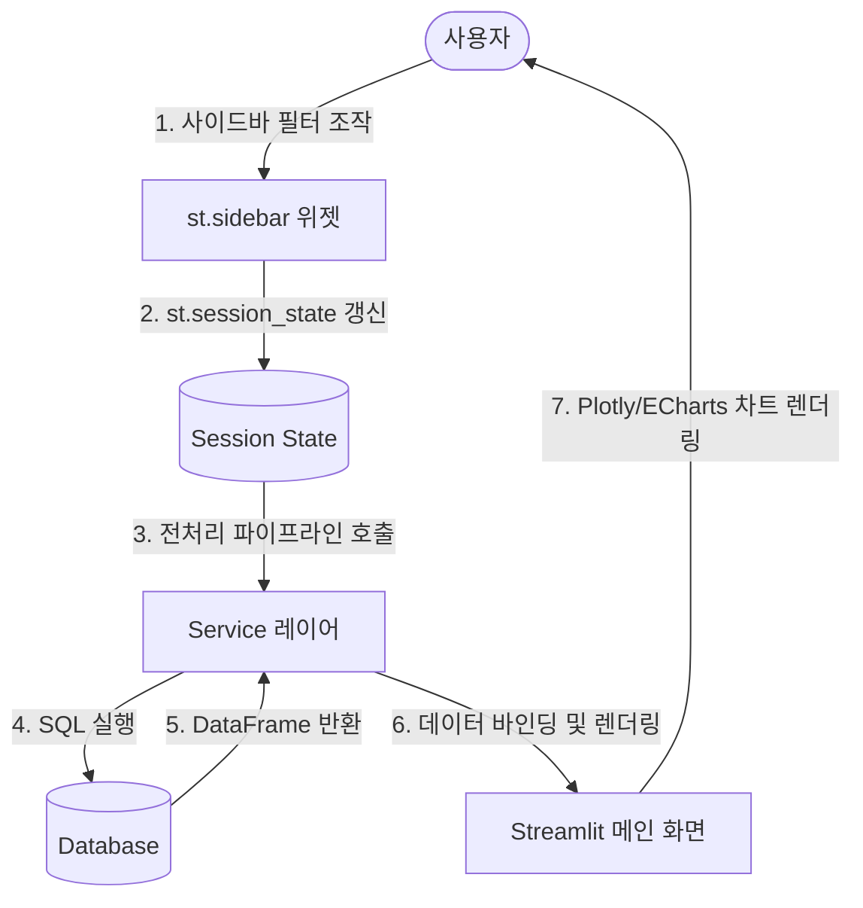

# 대시보드 및 화면 개발 공통 표준 (Dashboard Development Standard)

[문서 정보]
- 작성일: 2026-07-23
- 버전: v1.1 (사용자 상호작용 및 에러 폴백 개정)
- 대상 범위: 모든 Streamlit 대시보드 페이지, 서비스 레이어 및 시각화(ECharts/Plotly) 모듈

---

## 1. 시각 테마 및 컬러 표준 (Core Palette & Design Token)

모든 시각화 및 UI 컴포넌트는 무분별한 색상 사용을 배제하고 통계적 인지 편의를 위해 정밀하게 제한된 컬러 계층을 고수합니다.

### 1.1. 95% Grayscale & 5% Orange Accent 원칙
*   **일반 데이터 및 정상 범위 (95% Grayscale)**:
    *   모든 정상 수치 막대, 추세선, 영역 채우기 등은 오직 Slate 모노크롬 계열의 명도 대비로만 정돈합니다.
    *   주색상: `colors.slate_800` (주요 선, 데이터 마커, 강조 텍스트)
    *   보조색상: `colors.slate_400` (보조 선, UCL/LCL 한계선, 비강조 데이터)
    *   연한색상: `colors.slate_200` / `slate_100` (배경 쉐이딩, 비교 데이터)
*   **이상 범위 및 경고 (5% Anomaly Accent)**:
    *   규격 이탈(Out of Spec / Out of Control), 부적합(Fail), 합격률 80% 미만의 핵심 액션 영역에만 `colors.orange_500` 단일 Accent 컬러를 집중 투입하여 시각 인지 효율을 극대화합니다.
*   **다중 범주형 데이터(Categorical Data) 예외**:
    *   CQMS 등록 이력(품질이슈, 4M 변경, Audit 등) 및 사양 개정 정보(V, S, P, M, T)에 한해 식별성을 보장하는 **IBM Carbon 14-색 공식 Categorical sequence** 및 데이터 전용 컬러(Data Colors) 매핑을 허용합니다.

### 1.2. 디자인 토큰 및 가이드라인
*   **토큰 파일 경로**: `app/core/design_system/tokens/colors.py`
*   **가이드라인선**: UCL, LCL, Spec Limit 등은 차트 뒤로 차분히 가라앉히기 위해 실선 대신 `colors.slate_400` 계열의 얇은 대시선(dash)을 배치합니다.

---

## 2. 성능 최적화 및 캐싱 표준 (Performance & Caching)

*   **@st.cache_data 적용 원칙**:
    *   자주 변경되지 않는 자재 코드 마스터, 규격 정보 조회 등의 정적 메타데이터성 SQL 쿼리 및 전처리 함수는 반드시 Streamlit 내장 `@st.cache_data` 데코레이터를 적용합니다.
    *   배치로 연산이 완료되어 변경 주기가 고정된 데이터(예: 일별 배치 데이터)는 불필요한 네트워크 왕복 오버헤드를 막기 위해 적극 캐싱합니다.
*   **Databricks 쿼리 최적화**:
    *   원격 Cloud DW 호출 시 다중 CTE(Common Table Expressions) 통합 조인을 실행하여, 데이터 수집 시 원격 DB 서버로의 왕복(Round-trip) 횟수를 단 1회로 병합하고 지연을 최소화합니다.

---

## 3. 권한 및 보안 표준 (Security & Authorization)

*   **환경 변수 수립**:
    *   DB 비밀번호, 토큰, 암호키 등 민감한 자격 증명(Credentials)은 절대 소스 코드나 마크다운 파일에 평문으로 남기지 않으며, 오직 `.env` 환경 변수 또는 OS 보안 보안 영역을 통해 인입해야 합니다.
*   **데이터 접근 통제**:
    *   로그인한 계정의 소속 공장 식별키를 기반으로 데이터를 자동 필터링하여, 타 공장 민감 정보로의 불법 접근을 원천 통제합니다.

---

## 4. 반응형 UI, 예외 및 사용성 표준 (UX & Robustness)

*   **디바이스 호환성**:
    *   모든 페이지 레이아웃은 모바일, 태블릿, PC 브라우저 환경에서 찌그러지지 않는 반응형 비율 유지를 보장합니다.
*   **수평 정렬 보정**:
    *   위젯 높이 불일치로 인한 UI 어긋남을 극복하기 위해 `st.columns(..., vertical_alignment="top")` 파라미터를 사용하며, 타이틀 옆의 사이드바 셀렉트박스는 `label_visibility="collapsed"`로 높이를 보정합니다.
*   **Null / 결측 표시 규격**:
    *   비즈니스 상 데이터가 누락되었거나 계산 불가한 레코드는 화면상에 빈칸이나 `None` 대신 하이픈(`-`) 기호 또는 0으로 강제 통일하여 시각적 무결성을 유지합니다.

### 4.1. 장애 처리 및 에러 폴백 가이드라인 (Robust Error Handling)
*   **Databricks/원격 DB 조회 실패 시**:
    *   화면 전체가 크래시(Crash)되는 현상을 방지하기 위해 예외를 포착하여 실적 영역을 **오류 상태(예: "데이터 로딩 실패" 경고 메세지)**로 명확히 시각화하여 노출합니다.
    *   시스템은 **"데이터 없음(실제 집계결과가 0인 정상 케이스)"**과 **"원천 DB 호출 실패(장애 상태)"**를 사용자에게 명확히 구분하여 디스플레이해야 합니다.
    *   로컬 캐시 등의 수단으로 마지막 정상 조회 데이터가 존재하는 경우, **마지막 정상 조회 시각(Timestamp)**을 "마지막 업데이트: YYYY-MM-DD HH:MM:SS (로컬 데이터)" 형태로 함께 표출하여 사용자의 오해를 방지합니다.

---

## 5. 공통 사용자 상호작용 흐름 (Standard Streamlit Userflow)

모든 Streamlit 페이지 컨트롤러는 기본적으로 단방향 반응형 렌더링 루프를 따릅니다. 화면 진입, 필터 조작, 상태 전이 및 최종 렌더링에 이르는 표준 생명 주기는 다음과 같습니다.

---

## 6. 품질 검증 및 지식 자산 표준 (Verification & Knowledge Graph)

*   **정적 코드 분석**:
    *   화면 배포 전 반드시 `verify_code.py` 정적 분석 검사를 가동하여 AST 구문 무결성을 통과(Exit Code: 0)해야 합니다.
*   **위키 링크 표준**:
    *   프로젝트 내 마크다운 자산 간의 연결 고리는 절대 절대 경로를 불허하며, 반드시 워크스페이스 루트 기준의 평문 상대 경로(예: `.agents/wiki/dashboard_development_standard.md`)로 빌드하여 협업 환경에서의 깨진 링크 발생을 차단합니다.
